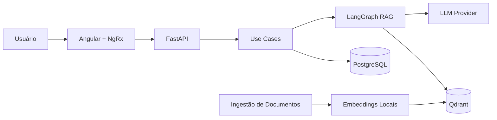

# Nexus

> Uma plataforma RAG para centralizar conhecimento organizacional em assistentes conversacionais — projeto de pós-graduação.

---

## A História por Trás do Projeto

Toda organização acumula conhecimento. Manuais, atas, políticas, wikis, arquivos em pastas compartilhadas. O problema não é falta de informação — é encontrar a informação certa, no momento certo, sem depender de quem "sabe de cabeça".

A pergunta que motivou o Nexus foi simples: **e se qualquer pessoa pudesse conversar com os documentos oficiais da empresa e receber respostas confiáveis, ancoradas naquele conteúdo?**

O caminho escolhido foi RAG — Retrieval-Augmented Generation. Em vez de confiar apenas no que o modelo de linguagem "aprendeu", a arquitetura recupera trechos relevantes dos documentos antes de gerar cada resposta. O resultado é rastreável: a resposta vem do que está escrito, não de uma inferência genérica.

O Nexus foi construído como projeto de pós-graduação, em ciclos incrementais, começando pela documentação antes do código. Cada decisão foi registrada como ADR. Cada etapa foi validada com critérios explícitos.

---

## O Que o Nexus Faz

1. **Cria assistentes** — cada um representa uma área, projeto ou domínio de conhecimento.
2. **Indexa documentos** — PDFs e DOCX são extraídos, divididos em chunks e vetorizados localmente.
3. **Responde perguntas** — o chat recupera contexto da base do assistente ativo e gera respostas com LLM.
4. **Mantém histórico** — conversas são persistidas e retomadas sem perder contexto.
5. **Isola conhecimento** — assistentes diferentes nunca misturam suas bases de busca.

---

## Como a IA é Usada

### Embeddings Locais

A vetorização dos documentos acontece dentro do próprio container, sem chamadas a APIs externas. O modelo escolhido foi `sentence-transformers/paraphrase-multilingual-MiniLM-L12-v2` — multilíngue, leve e compatível com documentos em português.

Cada chunk recebe um vetor de 384 dimensões e é gravado no Qdrant, na collection isolada do assistente.

### RAG com Isolamento por Assistente

Ao receber uma pergunta, o sistema consulta **apenas** a collection do assistente ativo. Não há vazamento de contexto entre assistentes. A busca semântica retorna os trechos mais relevantes, que são injetados no prompt junto com o histórico da conversa.

### Fluxo Conversacional com LangGraph

O grafo LangGraph coordena as etapas da conversa de forma explícita e testável:

```
Mensagem → Carregar histórico → Recuperar contexto RAG
         → Avaliar relevância
         → [contexto suficiente] Gerar resposta com LLM
         → [contexto insuficiente] Fallback: "não há evidência suficiente"
         → Persistir pergunta e resposta
```

A avaliação de relevância garante que o assistente não invente respostas quando a base não contém informação suficiente. O fallback é explícito — é uma decisão de produto, não um comportamento acidental.

### Provedor de LLM Configurável

O adapter de LLM é uma interface. A implementação concreta é definida por variável de ambiente, permitindo trocar o provedor sem alterar o domínio ou os casos de uso.

---

## Arquitetura



O backend segue **Clean Architecture** com quatro camadas:

| Camada | Responsabilidade |
|---|---|
| `domain` | Entidades, value objects e interfaces — sem dependência de frameworks |
| `application` | Casos de uso e serviços de aplicação |
| `infrastructure` | PostgreSQL, Qdrant, embeddings, LLM, LangGraph |
| `api` | Rotas FastAPI, schemas, injeção de dependências |

A regra de dependência é unidirecional: `api → application → domain`. O domínio não conhece FastAPI, SQLAlchemy, Qdrant ou qualquer SDK de IA.

---

## Stack de Ferramentas

| Categoria | Ferramenta | Por quê |
|---|---|---|
| Backend | FastAPI | Performance, tipagem nativa e geração automática de docs |
| ORM | SQLAlchemy 2.x | Async-first, compatível com psycopg3 |
| Banco relacional | PostgreSQL | Persistência de assistentes, conversas e histórico |
| Busca vetorial | Qdrant | Collections isoladas por assistente, fácil de rodar local |
| Embeddings | sentence-transformers | Multilíngue, local, sem custo por chamada |
| Grafo de IA | LangGraph | Fluxo conversacional explícito e testável |
| Extração de docs | PyPDF + python-docx | Suporte a PDF e DOCX sem dependências pesadas |
| Frontend | Angular 17+ | Framework robusto com lazy loading e standalone components |
| Estado | NgRx | Store reativa, rastreável e testável |
| Estilo | Tailwind CSS | Utilidade-first, consistência sem CSS custom |
| Ambiente | Docker Compose | Uma única dependência para rodar tudo localmente |

---

## Execução Local

```bash
# 1. Configure as variáveis de ambiente
cp .env.example .env

# 2. Suba o ambiente completo
docker compose up -d --build

# 3. Acesse
# Frontend:        http://localhost:4200
# Backend (docs):  http://localhost:8000/docs
# Backend (health): http://localhost:8000/health
```

Para o guia de validação ponta a ponta (assistente → documento → chat → histórico), consulte [`docs/infraestrutura/docker-local.md`](docs/infraestrutura/docker-local.md).

---

## Estrutura do Monorepo

```
nexus/
├── backend/            # FastAPI + Clean Architecture
│   └── src/
│       ├── api/        # Rotas e schemas
│       ├── application/# Casos de uso
│       ├── domain/     # Entidades e interfaces
│       └── infrastructure/ # PostgreSQL, Qdrant, LLM, LangGraph
├── frontend/           # Angular + NgRx + Tailwind
│   └── src/app/
│       ├── features/   # assistants, chat, documents
│       └── store/      # NgRx store, actions, effects
├── docs/
│   ├── arquitetura/    # ADRs, C4, fluxos
│   ├── infraestrutura/ # Docker, variáveis, troubleshooting
│   └── negocio/        # Visão, escopo, público, glossário
├── compose.yaml
└── .env.example
```

---

## Lições Aprendidas

**Documentar antes de codar funciona.** Começar pelos ADRs e pela visão de produto forçou decisões explícitas antes que o código tornasse tudo mais difícil de mudar. Mudar um documento é barato. Mudar uma abstração depois de implementada, não.

**RAG não é mágico — é um contrato.** A qualidade da resposta depende da qualidade da recuperação. Chunks mal dimensionados ou coleções mal isoladas geram respostas irrelevantes. O fallback explícito ("não há evidência suficiente") foi uma das decisões mais importantes do produto: preferir honestidade a alucinação.

**Embeddings locais valem o esforço.** Mover a vetorização para dentro do container eliminou latência variável, custo por chamada e dependência de disponibilidade externa. Para um MVP com volume imprevisível de documentos, foi a escolha certa.

**Clean Architecture paga o custo de setup.** Testar casos de uso sem Docker, sem banco, sem LLM real acelera o ciclo de desenvolvimento. O esforço inicial de definir interfaces e separar camadas se justificou nas primeiras semanas de implementação.

**LangGraph torna o fluxo auditável.** Em vez de código sequencial espalhado, o grafo torna as etapas visíveis, nomeadas e testáveis individualmente. Isso foi especialmente útil para o fallback — ficou claro exatamente onde e quando ele é ativado.

**Isolamento por collection é simples e funciona.** A estratégia de uma collection Qdrant por assistente pode parecer excessiva, mas elimina qualquer risco de mistura de contexto no MVP. É o tipo de decisão que vale errar pelo lado da segurança.

---

## Documentação

| Documento | Descrição |
|---|---|
| [Visão do produto](docs/negocio/visao-produto.md) | Contexto, proposta de valor e resultado esperado |
| [Escopo do MVP](docs/negocio/escopo-mvp.md) | O que está dentro e fora do escopo, critérios de aceite |
| [Problema e Solução](docs/negocio/problema-e-solucao.md) | O problema organizacional que o Nexus resolve |
| [Visão geral da arquitetura](docs/arquitetura/visao-geral.md) | Diagrama, componentes e decisões macro |
| [Clean Architecture no backend](docs/arquitetura/clean-architecture-backend.md) | Camadas, regras de dependência e exemplos |
| [Fluxo RAG e isolamento](docs/arquitetura/rag-e-isolamento-de-conhecimento.md) | Estratégia de ingestão e separação por assistente |
| [LangGraph conversacional](docs/arquitetura/langgraph-fluxo-conversacional.md) | Etapas do grafo, memória e regras de produto |
| [Plano incremental](docs/plano-incremental.md) | As 8 etapas de construção do MVP |
| [Docker local](docs/infraestrutura/docker-local.md) | Guia de execução e validação local |
