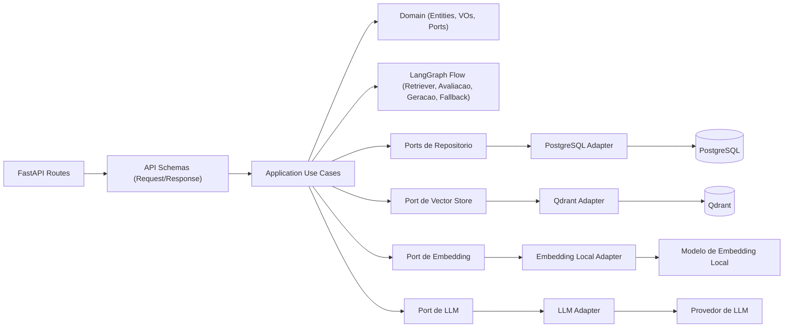

# C4 - Componentes do Backend

## Objetivo

Explicitar os componentes internos do backend e as dependências entre camadas.

## Diagrama de Componentes do Backend (C4 Nível 3)

## Notas de Arquitetura

- `domain` e `application` não conhecem FastAPI, Qdrant, PostgreSQL ou SDKs externos.
- `infrastructure` implementa adapters concretos para as portas definidas no domínio/aplicação.
- O fluxo LangGraph permanece na infraestrutura e é invocado por contratos da aplicação.
- O isolamento de conhecimento acontece pela estratégia de collection por assistente no Qdrant.
