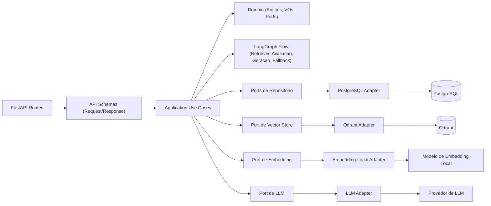
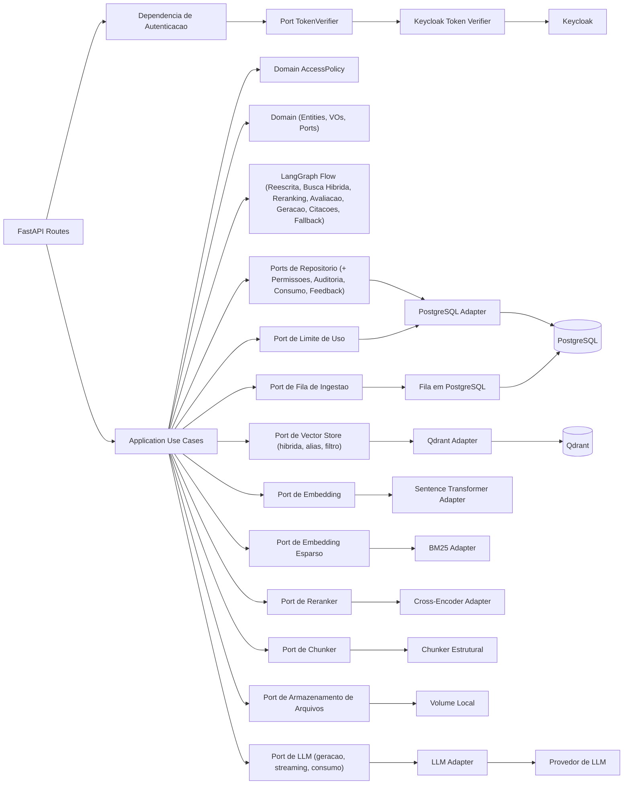

# C4 - Componentes do Backend

## Objetivo

Explicitar os componentes internos do backend e as dependências entre camadas.

## Diagrama de Componentes do Backend (C4 Nível 3)

```mermaid
flowchart LR
    Routes["FastAPI Routes"] --> Schemas["API Schemas (Request/Response)"]
    Schemas --> UseCases["Application Use Cases"]

    UseCases --> Domain["Domain (Entities, VOs, Ports)"]
    UseCases --> LangGraph["LangGraph Flow (Retriever, Avaliacao, Geracao, Fallback)"]
    UseCases --> RepoPort["Ports de Repositorio"]
    UseCases --> VectorPort["Port de Vector Store"]
    UseCases --> EmbPort["Port de Embedding"]
    UseCases --> LlmPort["Port de LLM"]

    RepoPort --> PgAdapter["PostgreSQL Adapter"]
    VectorPort --> QdrantAdapter["Qdrant Adapter"]
    EmbPort --> EmbAdapter["Embedding Local Adapter"]
    LlmPort --> LlmAdapter["LLM Adapter"]

    PgAdapter --> PG[("PostgreSQL")]
    QdrantAdapter --> QD[("Qdrant")]
    EmbAdapter --> LocalModel["Modelo de Embedding Local"]
    LlmAdapter --> Provider["Provedor de LLM"]
```

## Notas de Arquitetura

- `domain` e `application` não conhecem FastAPI, Qdrant, PostgreSQL ou SDKs externos.
- `infrastructure` implementa adapters concretos para as portas definidas no domínio/aplicação.
- O fluxo LangGraph permanece na infraestrutura e é invocado por contratos da aplicação.
- O isolamento de conhecimento acontece pela estratégia de collection por assistente no Qdrant.

## Evolução RAG Enterprise (Componentes Alvo)

Diagrama **planejado**; o diagrama acima continua representando o MVP.

```mermaid
flowchart LR
    Routes["FastAPI Routes"] --> AuthDep["Dependencia de Autenticacao"]
    AuthDep --> TokenPort["Port TokenVerifier"]
    Routes --> UseCases["Application Use Cases"]

    UseCases --> Policy["Domain AccessPolicy"]
    UseCases --> Domain["Domain (Entities, VOs, Ports)"]
    UseCases --> LangGraph["LangGraph Flow (Reescrita, Busca Hibrida, Reranking, Avaliacao, Geracao, Citacoes, Fallback)"]

    UseCases --> RepoPort["Ports de Repositorio (+ Permissoes, Auditoria, Consumo, Feedback)"]
    UseCases --> VectorPort["Port de Vector Store (hibrida, alias, filtro)"]
    UseCases --> EmbPort["Port de Embedding"]
    UseCases --> SparsePort["Port de Embedding Esparso"]
    UseCases --> RerankPort["Port de Reranker"]
    UseCases --> ChunkPort["Port de Chunker"]
    UseCases --> QueuePort["Port de Fila de Ingestao"]
    UseCases --> FilePort["Port de Armazenamento de Arquivos"]
    UseCases --> LimitPort["Port de Limite de Uso"]
    UseCases --> LlmPort["Port de LLM (geracao, streaming, consumo)"]

    TokenPort --> KcAdapter["Keycloak Token Verifier"]
    RepoPort --> PgAdapter["PostgreSQL Adapter"]
    QueuePort --> PgQueue["Fila em PostgreSQL"]
    LimitPort --> PgAdapter
    VectorPort --> QdrantAdapter["Qdrant Adapter"]
    EmbPort --> EmbAdapter["Sentence Transformer Adapter"]
    SparsePort --> Bm25Adapter["BM25 Adapter"]
    RerankPort --> RerankAdapter["Cross-Encoder Adapter"]
    ChunkPort --> ChunkAdapter["Chunker Estrutural"]
    FilePort --> VolumeAdapter["Volume Local"]
    LlmPort --> LlmAdapter["LLM Adapter"]

    KcAdapter --> KC["Keycloak"]
    PgAdapter --> PG[("PostgreSQL")]
    PgQueue --> PG
    QdrantAdapter --> QD[("Qdrant")]
    LlmAdapter --> Provider["Provedor de LLM"]
```

### Notas da Evolução

- As regras de acesso ficam no domínio (`AccessPolicy`); as rotas apenas obtêm o usuário autenticado.
- O worker é um segundo ponto de entrada do mesmo código: invoca casos de uso de aplicação
  (ingestão e, desde a PC-D4, reindexação), sem passar pelas rotas HTTP. Os comandos
  `src.cli.evaluate`, `src.cli.purge_audit` e `src.cli.check_consistency` (R18, PC-D3) são outros
  pontos de entrada.
- A porta `GroupDirectory` (PC-D6) é implementada pelo `KeycloakGroupDirectory`, que lê os grupos
  pela API de administração do Keycloak com o cliente de serviço `nexus-backend`.
- O caso de uso de avaliação, já implementado, reutiliza as portas de documentos, embedding,
  vector store e LLM do chat e acrescenta a porta `AnswerJudge`; é acionado pelo comando
  `python -m src.cli.evaluate`, não por rota HTTP.
- Logs estruturados e o middleware de identificador de requisição também já estão no código.
- Adaptadores de embedding, BM25, reranking e OCR executam localmente (ADR 0004 e ADR 0007).
- O `LocalHashEmbeddingGateway` permanece apenas como dublê de testes.
