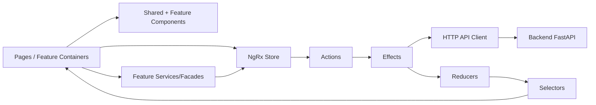

# C4 - Componentes do Frontend

## Objetivo

Descrever a organização do frontend Angular e o fluxo de estado via NgRx.

## Diagrama de Componentes do Frontend (C4 Nível 3)

## Responsabilidades

- **Pages / Feature Containers**: coordenam a tela e interações de usuário por feature.
- **Components**: apresentam UI reutilizável, com foco em composição e baixo acoplamento.
- **NgRx Store**: concentra estado previsível de assistente ativo, chat, documentos e erros.
- **Effects**: executam side effects assíncronos e integração HTTP com backend.
- **Reducers e Selectors**: transformam eventos em estado e oferecem leitura otimizada para UI.
- **API Client**: encapsula contratos HTTP para preservar consistência entre features.
