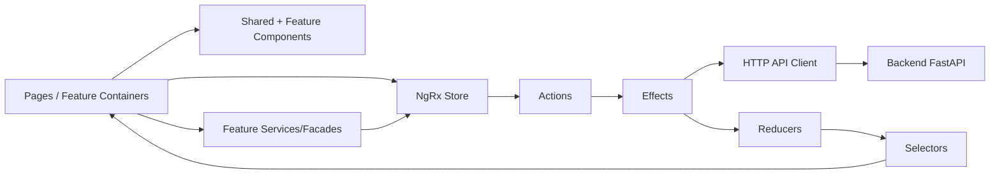
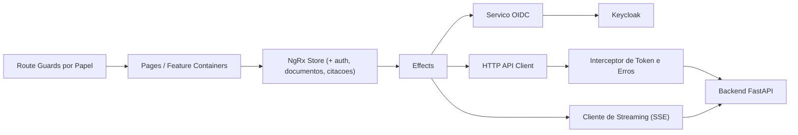

# C4 - Componentes do Frontend

## Objetivo

Descrever a organização do frontend Angular e o fluxo de estado via NgRx.

## Diagrama de Componentes do Frontend (C4 Nível 3)

```mermaid
flowchart LR
    Pages["Pages / Feature Containers"] --> Components["Shared + Feature Components"]
    Pages --> Store["NgRx Store"]

    Store --> Actions["Actions"]
    Actions --> Effects["Effects"]
    Effects --> ApiClient["HTTP API Client"]
    ApiClient --> Backend["Backend FastAPI"]

    Effects --> Reducers["Reducers"]
    Reducers --> Selectors["Selectors"]
    Selectors --> Pages

    Pages --> Facades["Feature Services/Facades"]
    Facades --> Store
```

## Responsabilidades

- **Pages / Feature Containers**: coordenam a tela e interações de usuário por feature.
- **Components**: apresentam UI reutilizável, com foco em composição e baixo acoplamento.
- **NgRx Store**: concentra estado previsível de assistente ativo, chat, documentos e erros.
- **Effects**: executam side effects assíncronos e integração HTTP com backend.
- **Reducers e Selectors**: transformam eventos em estado e oferecem leitura otimizada para UI.
- **API Client**: encapsula contratos HTTP para preservar consistência entre features.

## Evolução RAG Enterprise (Componentes Alvo)

Diagrama **planejado**; o diagrama acima continua representando o MVP.

```mermaid
flowchart LR
    Guards["Route Guards por Papel"] --> Pages["Pages / Feature Containers"]
    Pages --> Store["NgRx Store (+ auth, documentos, citacoes)"]
    Store --> Effects["Effects"]
    Effects --> AuthService["Servico OIDC"]
    AuthService --> KC["Keycloak"]
    Effects --> ApiClient["HTTP API Client"]
    ApiClient --> Interceptor["Interceptor de Token e Erros"]
    Interceptor --> Backend["Backend FastAPI"]
    Effects --> StreamClient["Cliente de Streaming (SSE)"]
    StreamClient --> Backend
```

### Novas Responsabilidades

- **Serviço OIDC**: login, logout e renovação silenciosa pelo Keycloak (PKCE).
- **Interceptor**: anexa o token e trata respostas 401, 403 e 429.
- **Route Guards**: bloqueiam rotas conforme o papel e redirecionam para o login.
- **Store**: novo estado de sessão; documentos com estado de ingestão; mensagens com citações e feedback.
- **Cliente de Streaming**: recebe a resposta em partes e as fontes ao final.
- **Novas telas**: permissões do assistente, gestão de documentos, índice de busca, auditoria,
  consumo, avaliações e conversas arquivadas.
