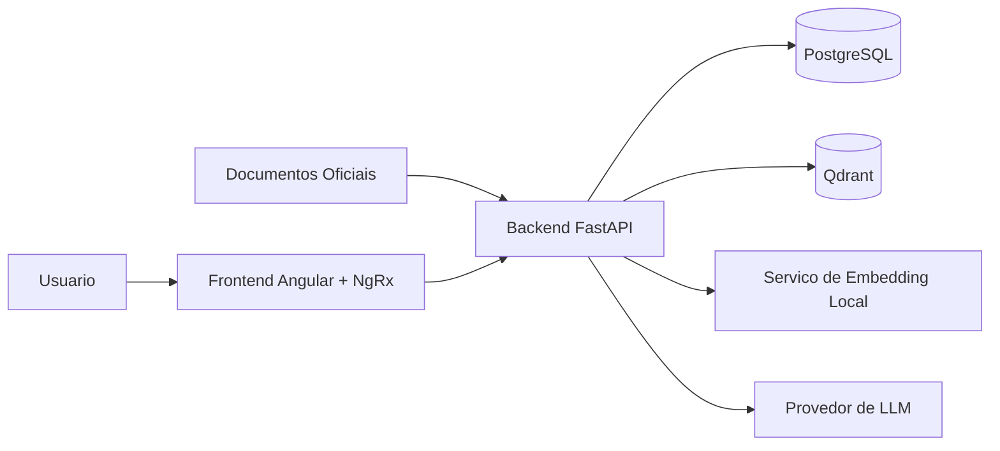

# C4 - Containers do Nexus

## Objetivo

Detalhar os principais containers executáveis do sistema e suas integrações.

## Diagrama de Containers (C4 Nível 2)

## Responsabilidades por Container

- **Frontend Angular + NgRx**: interface de assistentes, documentos e chat.
- **Backend FastAPI**: API HTTP, casos de uso, orquestração do fluxo conversacional e ingestão.
- **PostgreSQL**: persistência transacional de assistentes, documentos, conversas e mensagens.
- **Qdrant**: armazenamento vetorial com collection isolada por assistente.
- **Serviço de Embedding Local**: geração de embeddings sem dependência de LLM externa.
- **Provedor de LLM**: geração de respostas a partir de contexto recuperado.
