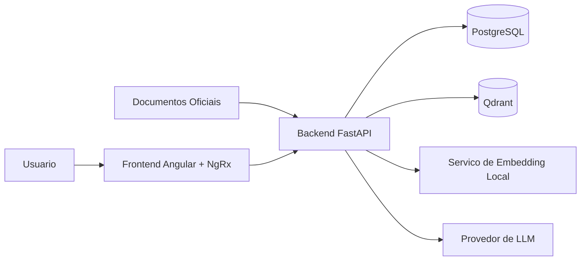
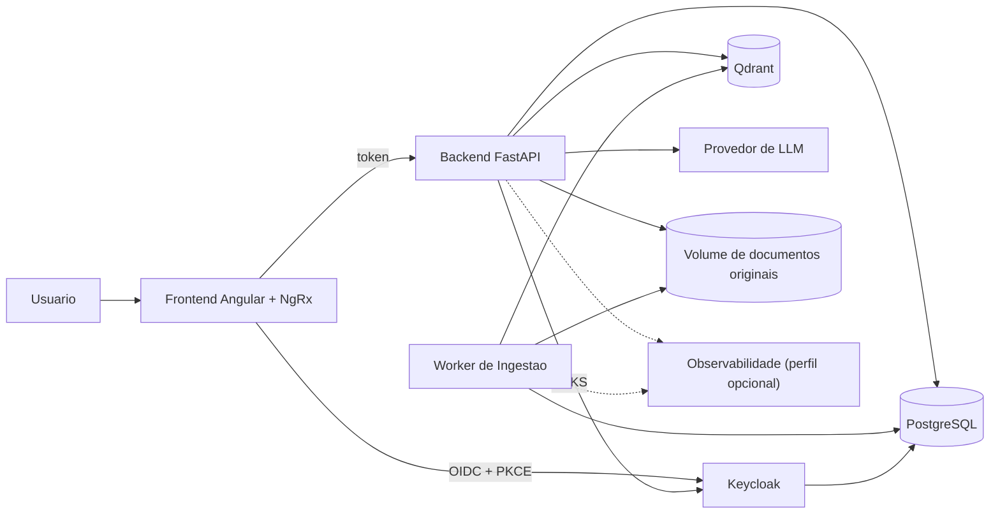

# C4 - Containers do Nexus

## Objetivo

Detalhar os principais containers executáveis do sistema e suas integrações.

## Diagrama de Containers (C4 Nível 2)

```mermaid
flowchart LR
    User["Usuario"] --> Web["Frontend Angular + NgRx"]
    Docs["Documentos Oficiais"] --> API["Backend FastAPI"]
    Web --> API
    API --> PG[("PostgreSQL")]
    API --> QD[("Qdrant")]
    API --> EMB["Servico de Embedding Local"]
    API --> LLM["Provedor de LLM"]
```

## Responsabilidades por Container

- **Frontend Angular + NgRx**: interface de assistentes, documentos e chat.
- **Backend FastAPI**: API HTTP, casos de uso, orquestração do fluxo conversacional e ingestão.
- **PostgreSQL**: persistência transacional de assistentes, documentos, conversas e mensagens.
- **Qdrant**: armazenamento vetorial com collection isolada por assistente.
- **Serviço de Embedding Local**: geração de embeddings sem dependência de LLM externa.
- **Provedor de LLM**: geração de respostas a partir de contexto recuperado.

## Evolução RAG Enterprise (Containers Alvo)

Diagrama **planejado**; o diagrama acima continua representando o MVP.

```mermaid
flowchart LR
    User["Usuario"] --> Web["Frontend Angular + NgRx"]
    Web -->|"OIDC + PKCE"| KC["Keycloak"]
    Web -->|"token"| API["Backend FastAPI"]
    API -->|"JWKS"| KC
    API --> PG[("PostgreSQL")]
    API --> QD[("Qdrant")]
    API --> LLM["Provedor de LLM"]
    API --> FS[("Volume de documentos originais")]
    Worker["Worker de Ingestao"] --> PG
    Worker --> QD
    Worker --> FS
    KC --> PG
    API -.-> OTEL["Observabilidade (perfil opcional)"]
    Worker -.-> OTEL
```

### Responsabilidades dos novos containers

- **Keycloak**: autenticação, papéis e grupos; usa um banco próprio no PostgreSQL existente.
- **Worker de Ingestão**: mesma imagem do backend; extrai, aplica OCR, fragmenta, vetoriza e
  indexa em segundo plano, lendo a fila armazenada no PostgreSQL. Também executa as reindexações
  pedidas pela API (PC-D4) e, sob demanda, a conferência de contagens com o Qdrant roda pela
  mesma imagem (`python -m src.cli.check_consistency`, PC-D3).
- **Keycloak (cliente de serviço)**: além de emitir os tokens, responde ao backend a lista de
  grupos do realm pelo cliente `nexus-backend`, só de leitura (PC-D6).
- **Volume de documentos originais**: guarda os arquivos enviados para reprocessamento.
- **Observabilidade**: coletor e visualização de rastreamentos e métricas, ativados por perfil.

### Mudanças nos containers existentes

- **Backend FastAPI**: valida tokens, aplica a política de acesso, enfileira ingestão, executa
  busca híbrida e reranking e carrega os modelos locais a partir do volume de cache.
- **PostgreSQL**: passa a armazenar permissões, auditoria, fila de ingestão, consumo, feedback e o
  banco do Keycloak.
- **Qdrant**: collections versionadas com alias, vetores denso e esparso e índice de payload de acesso.
- **Serviço de Embedding Local**: continua dentro do backend e do worker; deixa de ser um hash e
  passa a ser o modelo da ADR 0004.
