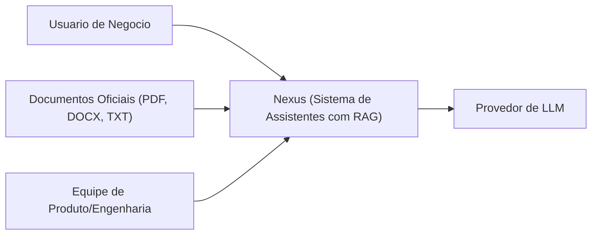

# C4 - Contexto do Sistema Nexus

## Objetivo

Descrever os atores e sistemas externos que interagem com o Nexus no escopo do MVP.

## Diagrama de Contexto (C4 Nível 1)

## Observações

- O usuário interage com o Nexus para criar assistentes, enviar documentos e conversar.
- Os documentos oficiais são a base de conhecimento que alimenta o processo de ingestão.
- O provedor de LLM é usado apenas para geração de resposta, não para embeddings.
- A equipe de produto/engenharia opera o sistema via ambiente local Docker no MVP.
