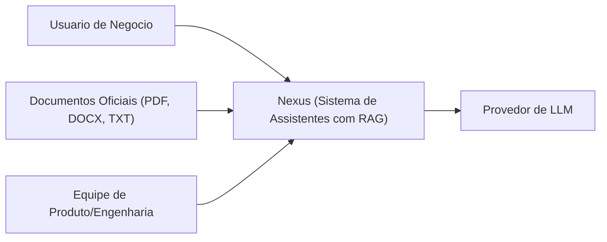
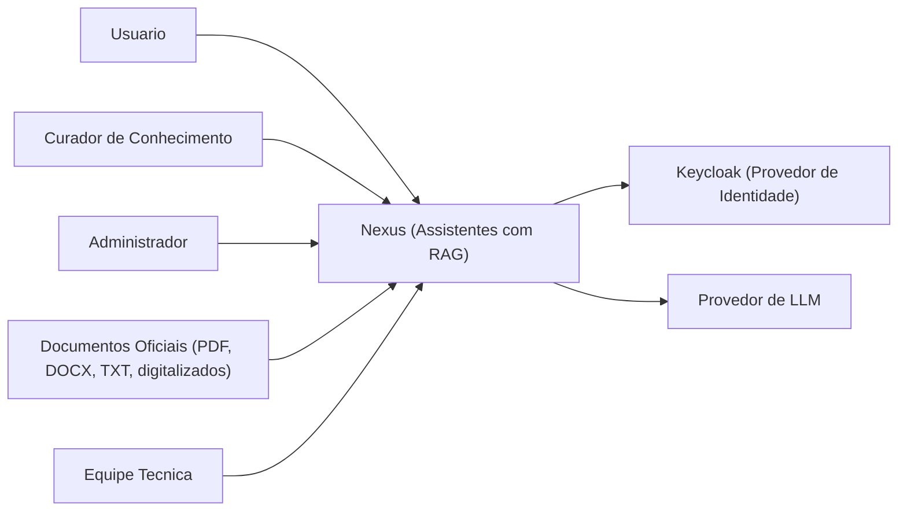

# C4 - Contexto do Sistema Nexus

## Objetivo

Descrever os atores e sistemas externos que interagem com o Nexus no escopo do MVP.

## Diagrama de Contexto (C4 Nível 1)

```mermaid
flowchart LR
    User["Usuario de Negocio"] --> Nexus["Nexus (Sistema de Assistentes com RAG)"]
    Docs["Documentos Oficiais (PDF, DOCX, TXT)"] --> Nexus
    Nexus --> LLM["Provedor de LLM"]
    DevOps["Equipe de Produto/Engenharia"] --> Nexus
```

## Observações

- O usuário interage com o Nexus para criar assistentes, enviar documentos e conversar.
- Os documentos oficiais são a base de conhecimento que alimenta o processo de ingestão.
- O provedor de LLM é usado apenas para geração de resposta, não para embeddings.
- A equipe de produto/engenharia opera o sistema via ambiente local Docker no MVP.

## Evolução RAG Enterprise (Contexto Alvo)

Diagrama **planejado**; o diagrama acima continua representando o MVP.

```mermaid
flowchart LR
    User["Usuario"] --> Nexus["Nexus (Assistentes com RAG)"]
    Curator["Curador de Conhecimento"] --> Nexus
    Admin["Administrador"] --> Nexus
    Docs["Documentos Oficiais (PDF, DOCX, TXT, digitalizados)"] --> Nexus
    Nexus --> KC["Keycloak (Provedor de Identidade)"]
    Nexus --> LLM["Provedor de LLM"]
    DevOps["Equipe Tecnica"] --> Nexus
```

- **Usuário**: conversa com os assistentes a que seus grupos têm acesso e consulta as fontes.
- **Curador**: mantém os documentos e o conjunto de referência dos assistentes sob sua responsabilidade.
- **Administrador**: gerencia assistentes, permissões, configuração do LLM e consulta a auditoria.
- **Keycloak**: único provedor de identidade; autentica e informa papéis e grupos (ADR 0008).
- **Provedor de LLM**: continua usado apenas para geração e reescrita de perguntas, nunca para
  embeddings, reranking ou OCR.
- **Equipe técnica**: opera o ambiente, acompanha rastreamentos e métricas e executa a avaliação
  de qualidade, já disponível por linha de comando.
