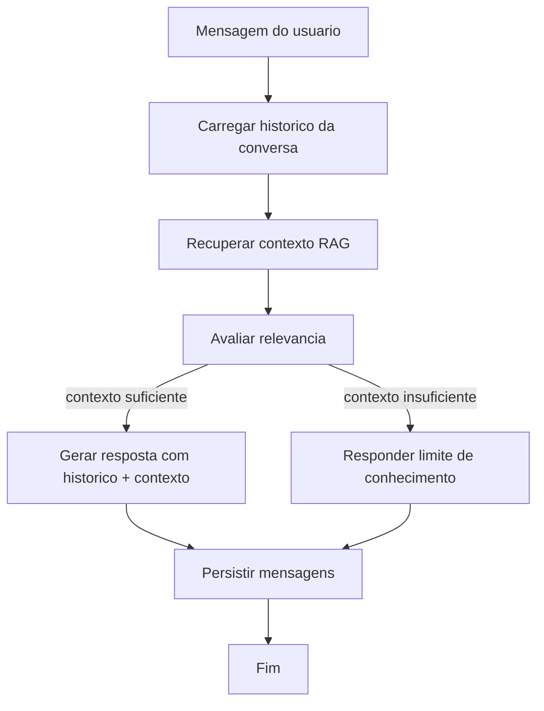

# Fluxo Conversacional com LangGraph

## Objetivo

Modelar a conversa RAG como um fluxo explícito e testável. O LangGraph deve coordenar etapas,
mas a aplicação continua responsável por iniciar casos de uso e persistir resultados.

## Fluxo Conversacional Atual

## Etapas

- **Carregar histórico**: recupera mensagens anteriores no PostgreSQL antes de registrar a nova pergunta.
- **Recuperar contexto**: consulta a collection do assistente ativo no Qdrant.
- **Avaliar relevância**: decide se os trechos recuperados são suficientes para responder.
- **Gerar resposta**: chama o provedor de LLM com pergunta atual, historico anterior e contexto RAG.
- **Fallback**: informa que a base do assistente não contém evidência suficiente.
- **Persistir mensagens**: grava pergunta e resposta no histórico da conversa.

## Memoria de Conversa

- **Memoria transacional (PostgreSQL)**: fonte de verdade do historico por conversa.
- **Memoria semantica (Qdrant)**: contexto recuperado dos documentos do assistente ativo.
- A resposta final combina as duas memorias, sem misturar dados entre assistentes.

## Regra de Produto

O assistente não deve apresentar como fato uma resposta que não esteja apoiada no contexto
recuperado. Quando não houver evidência suficiente, a resposta deve ser explícita sobre a
limitação.
