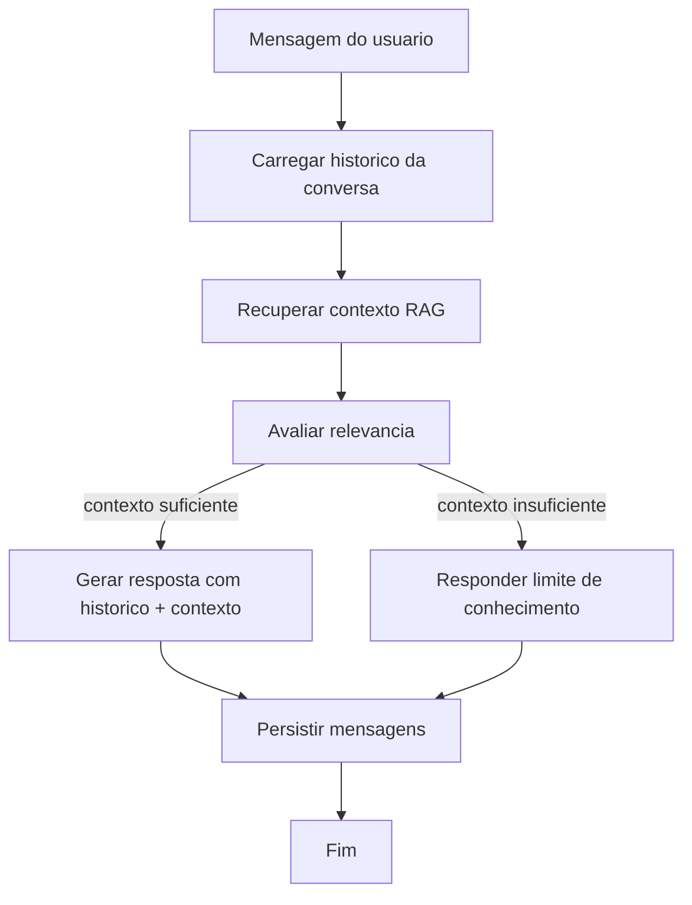
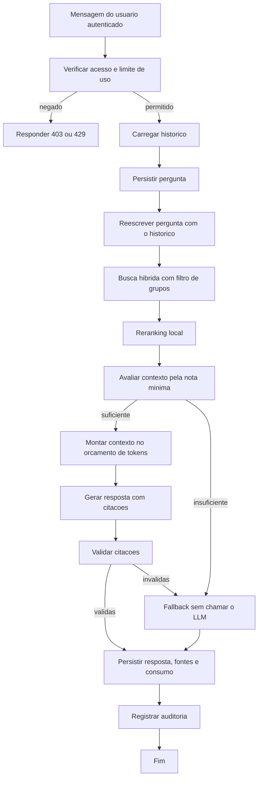

# Fluxo Conversacional com LangGraph

## Objetivo

Modelar a conversa RAG como um fluxo explícito e testável. O LangGraph deve coordenar etapas,
mas a aplicação continua responsável por iniciar casos de uso e persistir resultados.

## Fluxo Conversacional Atual

```mermaid
flowchart TD
    Start[Mensagem do usuario] --> LoadHistory[Carregar historico da conversa]
    LoadHistory --> Retrieve[Recuperar contexto RAG]
    Retrieve --> Evaluate[Avaliar relevancia]
    Evaluate -->|contexto suficiente| Generate[Gerar resposta com historico + contexto]
    Evaluate -->|contexto insuficiente| Fallback[Responder limite de conhecimento]
    Generate --> Persist[Persistir mensagens]
    Fallback --> Persist
    Persist --> End[Fim]
```

## Etapas

- **Carregar histórico**: recupera mensagens anteriores no PostgreSQL antes de registrar a nova pergunta.
- **Recuperar contexto**: consulta a collection do assistente ativo no Qdrant.
- **Avaliar relevância**: decide se os trechos recuperados são suficientes para responder.
- **Gerar resposta**: chama o provedor de LLM com pergunta atual, historico anterior e contexto RAG.
- **Fallback**: informa que a base do assistente não contém evidência suficiente.
- **Persistir mensagens**: grava pergunta e resposta no histórico da conversa.

## Memoria de Conversa

- **Memoria transacional (PostgreSQL)**: fonte de verdade do historico por conversa.
- **Memoria semantica (Qdrant)**: contexto recuperado dos documentos do assistente ativo.
- A resposta final combina as duas memorias, sem misturar dados entre assistentes.

## Regra de Produto

O assistente não deve apresentar como fato uma resposta que não esteja apoiada no contexto
recuperado. Quando não houver evidência suficiente, a resposta deve ser explícita sobre a
limitação.

## Evolução RAG Enterprise (Fluxo Alvo)

Fluxo definido pela [SPEC-003](../especificacao/specs/SPEC-003-busca-hibrida-reranking-citacoes.md).
As etapas da reescrita à validação das citações estão implementadas desde 2026-10-07 (ainda não
executadas no ambiente Docker) e substituem o fluxo acima. Verificação de acesso, limite de uso,
filtro de grupos, consumo e auditoria continuam **planejados** (Fases 4 e 6).

```mermaid
flowchart TD
    Start[Mensagem do usuario autenticado] --> Access[Verificar acesso e limite de uso]
    Access -->|negado| Deny[Responder 403 ou 429]
    Access -->|permitido| LoadHistory[Carregar historico]
    LoadHistory --> PersistUser[Persistir pergunta]
    PersistUser --> Rewrite[Reescrever pergunta com o historico]
    Rewrite --> Retrieve[Busca hibrida com filtro de grupos]
    Retrieve --> Rerank[Reranking local]
    Rerank --> Evaluate[Avaliar contexto pela nota minima]
    Evaluate -->|suficiente| Budget[Montar contexto no orcamento de tokens]
    Evaluate -->|insuficiente| Fallback[Fallback sem chamar o LLM]
    Budget --> Generate[Gerar resposta com citacoes]
    Generate --> Validate[Validar citacoes]
    Validate -->|validas| Persist[Persistir resposta, fontes e consumo]
    Validate -->|invalidas| Fallback
    Fallback --> Persist
    Persist --> Audit[Registrar auditoria]
    Audit --> End[Fim]
```

### Etapas Novas ou Alteradas

- **Verificar acesso e limite de uso**: feito no caso de uso, antes de o grafo iniciar.
- **Reescrever pergunta**: transforma perguntas de continuação em consultas autônomas; ignorada
  quando não há histórico.
- **Busca híbrida**: vetor denso e BM25 com fusão RRF, restrita aos documentos que o usuário pode ver.
- **Reranking**: cross-encoder local reordena os candidatos e mantém os melhores.
- **Avaliar contexto**: passa a usar nota mínima; hoje o fallback só ocorre quando a busca não
  devolve nenhum trecho.
- **Montar contexto**: limita histórico e trechos ao orçamento de tokens e delimita os trechos
  como dados.
- **Validar citações**: uma resposta sem citação válida é substituída pelo fallback.
- **Persistir**: grava também as fontes e o consumo de tokens.

### Observabilidade do Fluxo

Desde a Fase 1, o fluxo atual registra eventos de log estruturado com o identificador da
requisição: `chat.context.evaluated`, `chat.answer.generating` e `chat.fallback.used`, além dos
eventos `llm.request.*` do adaptador de LLM. Eles carregam apenas contagens e tamanhos.

Na Fase 6, cada nó passa a gerar também um span de rastreamento com duração e contagens, sem
conteúdo de documentos nem a pergunta completa.

### Regra de Produto

Permanece e é reforçada: além de não apresentar como fato o que não está no contexto, toda
resposta gerada deve indicar as fontes que a sustentam.
