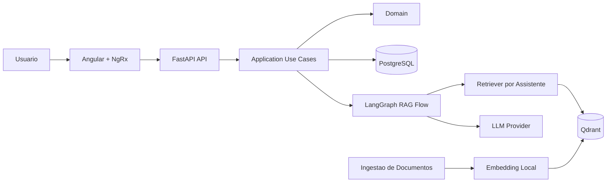

# Visão Geral da Arquitetura

## Decisão Arquitetural

O Nexus será um monorepo com backend FastAPI, frontend Angular e serviços de apoio via Docker.
A arquitetura favorece um MVP testável sem acoplar regras de negócio a provedores externos.

## Componentes

- **Frontend**: aplicação Angular responsável por assistentes, documentos e chat.
- **Backend API**: expõe casos de uso via HTTP e valida contratos de entrada e saída.
- **Application**: orquestra criação de assistentes, ingestão, chat e histórico.
- **Domain**: define entidades, value objects e interfaces independentes de frameworks.
- **Infrastructure**: implementa banco, Qdrant, embeddings, LLM e fluxo LangGraph.
- **PostgreSQL**: persiste assistentes, documentos, conversas e mensagens.
- **Qdrant**: armazena embeddings em collections isoladas por assistente.

## Ajustes em Relação ao Plano Inicial

- O MVP não deve começar com múltiplos bancos lógicos ou microserviços; um backend modular é
  suficiente.
- O LangGraph fica na infraestrutura, mas é acionado por contratos da aplicação para não virar
  regra de negócio.
- A coleção por assistente é a estratégia inicial de isolamento no Qdrant. Permissões avançadas
  ficam para depois.
- Embeddings devem ser locais desde o início para manter previsibilidade de custo e reduzir
  dependência externa.
- O provedor de LLM deve ser uma interface. A implementação concreta pode ser local ou externa,
  definida por configuração.
