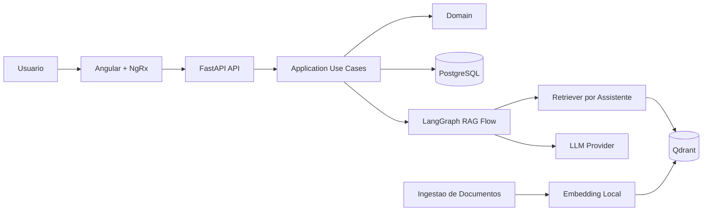
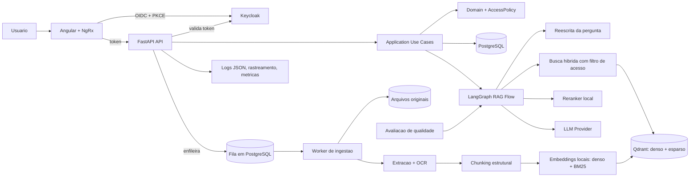

# Visão Geral da Arquitetura

## Decisão Arquitetural

O Nexus será um monorepo com backend FastAPI, frontend Angular e serviços de apoio via Docker.
A arquitetura favorece um MVP testável sem acoplar regras de negócio a provedores externos.


```mermaid
flowchart LR
    User[Usuario] --> Frontend[Angular + NgRx]
    Frontend --> API[FastAPI API]
    API --> UseCases[Application Use Cases]
    UseCases --> Domain[Domain]
    UseCases --> ConversationStore[(PostgreSQL)]
    UseCases --> RAG[LangGraph RAG Flow]
    RAG --> Retriever[Retriever por Assistente]
    RAG --> LLM[LLM Provider]
    Retriever --> Qdrant[(Qdrant)]
    Ingestion[Ingestao de Documentos] --> Embeddings[Embedding Local]
    Embeddings --> Qdrant
```

## Componentes

- **Frontend**: aplicação Angular responsável por assistentes, documentos e chat.
- **Backend API**: expõe casos de uso via HTTP e valida contratos de entrada e saída.
- **Application**: orquestra criação de assistentes, ingestão, chat e histórico.
- **Domain**: define entidades, value objects e interfaces independentes de frameworks.
- **Infrastructure**: implementa banco, Qdrant, embeddings, LLM e fluxo LangGraph.
- **PostgreSQL**: persiste assistentes, documentos, conversas e mensagens.
- **Qdrant**: armazena embeddings em collections isoladas por assistente.

## Árvore Oficial do Monorepo

```text
nexus/
├── backend/
│   ├── README.md
│   ├── src/
│   │   ├── api/
│   │   │   ├── routes/
│   │   │   └── schemas/
│   │   ├── application/
│   │   │   ├── dto/
│   │   │   ├── services/
│   │   │   └── use_cases/
│   │   ├── domain/
│   │   └── infrastructure/
│   │       ├── database/
│   │       ├── embeddings/
│   │       ├── langgraph/
│   │       ├── llm/
│   │       └── vector_store/
│   └── tests/
│       ├── integration/
│       └── unit/
├── docs/
│   ├── arquitetura/
│   │   ├── adrs/
│   │   ├── c4-componentes-backend.md
│   │   ├── c4-componentes-frontend.md
│   │   ├── c4-containers.md
│   │   ├── c4-contexto.md
│   │   ├── clean-architecture-backend.md
│   │   ├── frontend-angular-ngrx.md
│   │   ├── langgraph-fluxo-conversacional.md
│   │   ├── rag-e-isolamento-de-conhecimento.md
│   │   └── visao-geral.md
│   ├── infraestrutura/
│   ├── negocio/
│   └── plano-incremental.md
├── frontend/
│   ├── README.md
│   └── src/app/
│       ├── core/
│       ├── features/
│       │   ├── assistants/
│       │   ├── chat/
│       │   └── documents/
│       ├── shared/
│       └── store/
├── infra/
│   └── docker/
│       ├── README.md
│       └── scripts/
├── scripts/
│   └── README.md
├── .env.example
├── .gitignore
├── compose.yaml
└── README.md
```

## Ajustes em Relação ao Plano Inicial

- O MVP não deve começar com múltiplos bancos lógicos ou microserviços; um backend modular é
  suficiente.
- O LangGraph fica na infraestrutura, mas é acionado por contratos da aplicação para não virar
  regra de negócio.
- A coleção por assistente é a estratégia inicial de isolamento no Qdrant. Permissões avançadas
  ficam para depois.
- Embeddings devem ser locais desde o início para manter previsibilidade de custo e reduzir
  dependência externa.
- O provedor de LLM deve ser uma interface. A implementação concreta pode ser local ou externa,
  definida por configuração.

## Evolução RAG Enterprise (Arquitetura Alvo)

Esta seção descreve a arquitetura **alvo** da evolução do RAG; o que está acima continua
descrevendo o MVP. Em 2026-10-07, a Fase 1 (avaliação de qualidade e logs estruturados) está
implementada e em validação; os demais componentes do diagrama ainda são planejados. A evolução está especificada em
[`docs/especificacao/specs/`](../especificacao/specs/README.md) e decidida nas ADRs 0006 a 0011.


```mermaid
flowchart LR
    User[Usuario] --> Frontend[Angular + NgRx]
    Frontend -->|OIDC + PKCE| KC[Keycloak]
    Frontend -->|token| API[FastAPI API]
    API -->|valida token| KC
    API --> UseCases[Application Use Cases]
    UseCases --> Domain[Domain + AccessPolicy]
    UseCases --> PG[(PostgreSQL)]
    UseCases --> RAG[LangGraph RAG Flow]
    RAG --> Rewrite[Reescrita da pergunta]
    RAG --> Hybrid[Busca hibrida com filtro de acesso]
    RAG --> Rerank[Reranker local]
    RAG --> LLM[LLM Provider]
    Hybrid --> Qdrant[(Qdrant: denso + esparso)]
    API -->|enfileira| Queue[(Fila em PostgreSQL)]
    Queue --> Worker[Worker de ingestao]
    Worker --> Files[(Arquivos originais)]
    Worker --> Extract[Extracao + OCR]
    Extract --> Chunker[Chunking estrutural]
    Chunker --> Emb[Embeddings locais: denso + BM25]
    Emb --> Qdrant
    Eval[Avaliacao de qualidade] --> RAG
    API --> Obs[Logs JSON, rastreamento, metricas]
```

### O que muda em relação ao MVP

| Aspecto | MVP | Arquitetura alvo |
|---------|-----|------------------|
| Embeddings | Hash determinístico de palavras | Modelo semântico local da ADR 0004 |
| Chunking | Corte fixo de 700 caracteres | Estrutural, em tokens, com seção e página |
| Busca | Densa, quatro vizinhos, sem nota mínima | Híbrida com RRF, reranking local e nota mínima |
| Resposta | Texto sem fontes | Citações validadas e persistidas |
| Acesso | Sem autenticação | Keycloak, papéis, grupos por assistente e por documento |
| Ingestão | Síncrona na requisição | Assíncrona, com worker, estados e novas tentativas |
| Ciclo de vida | Apenas inclusão | Exclusão, substituição, deduplicação e reprocessamento |
| Qualidade | Sem medida | Conjunto de referência e avaliação na integração contínua |
| Operação | Arquivo de depuração | Logs estruturados, rastreamento, métricas, custo e backup |
| Banco | `create_all` na subida | Migrações versionadas |

### Situação por fase

| Fase | O que entrega | Situação |
|------|---------------|----------|
| 1 | Avaliação de qualidade, logs estruturados e identificador de requisição | Implementada, em validação no Docker |
| 2 | Embeddings semânticos locais, chunking estrutural, reindexação | Especificada |
| 3 | Busca híbrida, reranking, citações | Especificada |
| 4 | Keycloak, permissões, auditoria | Especificada |
| 5 | Worker, fila, ciclo de vida de documentos, OCR | Especificada |
| 6 | Rastreamento, métricas, custo, streaming, backup | Especificada |

### Novos componentes

- **Keycloak**: provedor de identidade; emite tokens com papéis e grupos.
- **Worker de ingestão**: mesma imagem do backend, processa a fila em segundo plano.
- **Fila em PostgreSQL**: tabela de jobs, sem broker dedicado.
- **Armazenamento de originais**: volume com os arquivos enviados.
- **Reranker local** e **embeddings esparsos**: executados no próprio ambiente.
- **Avaliação de qualidade**: caso de uso que mede o pipeline pelas mesmas portas do chat. Já
  implementado, com o comando `python -m src.cli.evaluate`.

### Princípios preservados

- Embeddings, vetores esparsos, reranking e OCR permanecem locais (ADR 0004).
- Uma collection por assistente continua sendo a fronteira de isolamento (ADR 0003).
- Monólito modular: o worker é o mesmo código do backend, não um microsserviço.
- O domínio continua sem conhecer frameworks; tudo o que é novo entra atrás de portas.
- O fallback explícito continua sendo regra de produto e passa a ser acionado por nota mínima.

### Árvore da evolução (acréscimos)

Itens marcados com `[ok]` já existem no repositório; os demais são previstos.

```text
nexus/
├── backend/
│   ├── src/api/middleware.py            # [ok] identificador de requisicao
│   ├── src/cli/evaluate.py              # [ok] comando de avaliacao
│   ├── src/domain/evaluation.py         # [ok] itens, metricas e relatorio
│   ├── src/infrastructure/
│   │   ├── evaluation/      # [ok] leitor JSONL, juiz por LLM, relatorios
│   │   ├── observability/   # [ok] logs JSON; rastreamento e metricas previstos
│   │   ├── auth/            # KeycloakTokenVerifier
│   │   ├── chunking/        # StructuralDocumentChunker
│   │   ├── queue/           # PostgresIngestionJobQueue
│   │   ├── reranking/       # CrossEncoderRerankerGateway
│   │   └── storage/         # LocalVolumeDocumentFileStorage
│   └── tests/
│       └── evaluation/      # [ok] conjunto de referencia piloto e relatorios
├── docs/
│   ├── especificacao/
│   │   ├── estrategia-de-testes.md   # [ok]
│   │   └── specs/           # [ok] SPEC-001 a SPEC-006
│   └── arquitetura/adrs/    # [ok] 0006 a 0011
├── infra/
│   └── keycloak/            # realm de desenvolvimento
└── scripts/                 # [ok] eval.sh e eval.ps1; backup.sh e restore.sh previstos
```
