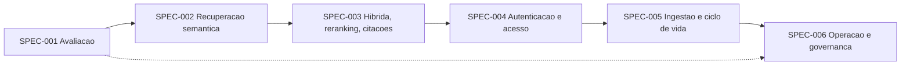

# Especificações SDD — Evolução RAG Enterprise

Esta pasta contém uma especificação por fase da evolução, no formato Spec-Driven Development:
nenhuma linha de código de uma fase é escrita antes de sua especificação estar aprovada, e os
testes são escritos antes da implementação.

## Ciclo

`SPEC → REVISÃO → TESTES → IMPLEMENTAÇÃO → VERIFICAÇÃO → REFATORAÇÃO → DOCUMENTAÇÃO`

## Especificações

| ID | Fase | Arquivo | Status | Requisitos |
|----|------|---------|--------|------------|
| SPEC-20261007-001 | 1 — Avaliação e linha de base | [`SPEC-001-avaliacao-e-linha-de-base.md`](SPEC-001-avaliacao-e-linha-de-base.md) | Aprovada (em validação) | RF-24 a RF-27 |
| SPEC-20261007-002 | 2 — Recuperação semântica | [`SPEC-002-recuperacao-semantica.md`](SPEC-002-recuperacao-semantica.md) | Aprovada (em implementação) | RF-28 a RF-32 |
| SPEC-20261007-003 | 3 — Busca híbrida, reranking e citações | [`SPEC-003-busca-hibrida-reranking-citacoes.md`](SPEC-003-busca-hibrida-reranking-citacoes.md) | Aprovada (em implementação) | RF-33 a RF-39 |
| SPEC-20261007-004 | 4 — Autenticação e controle de acesso | [`SPEC-004-autenticacao-e-controle-de-acesso.md`](SPEC-004-autenticacao-e-controle-de-acesso.md) | Aprovada (em implementação) | RF-40 a RF-47 |
| SPEC-20261007-005 | 5 — Ingestão e ciclo de vida | [`SPEC-005-ingestao-e-ciclo-de-vida.md`](SPEC-005-ingestao-e-ciclo-de-vida.md) | Aprovada (em implementação) | RF-48 a RF-55 |
| SPEC-20261007-006 | 6 — Operação e governança | [`SPEC-006-operacao-e-governanca.md`](SPEC-006-operacao-e-governanca.md) | Rascunho | RF-56 a RF-63 |

## Status possíveis

`Rascunho` → `Em revisão` → `Aprovada` → `Implementada`. A aprovação é registrada no próprio
arquivo, com data e responsável.

## Ordem e dependências

A SPEC-001 vem primeiro porque fornece a medida de todas as demais; a SPEC-006 reutiliza sua
avaliação na integração contínua.

## Situação

Em 2026-10-07 a SPEC-001 foi aprovada e implementada; falta executar os testes de integração e a
avaliação no ambiente Docker para marcá-la como `Implementada`. A SPEC-002 foi aprovada na mesma
data e está em implementação, conforme o
[plano de implementação](SPEC-002-plano-de-implementacao.md). A SPEC-003 foi aprovada também em
2026-10-07 e teve o código entregue sobre a Fase 2 ainda não validada no Docker, conforme o
[plano de implementação](SPEC-003-plano-de-implementacao.md). A SPEC-004 foi aprovada na mesma
data e teve o código entregue sobre as Fases 2 e 3 ainda não validadas no Docker, conforme o
[plano de implementação](SPEC-004-plano-de-implementacao.md). A SPEC-005 foi aprovada em
2026-10-08 e teve o código entregue sobre as Fases 2 a 4 ainda não validadas no Docker, conforme o
[plano de implementação](SPEC-005-plano-de-implementacao.md). A SPEC-006 aguarda revisão.

## Decisões já tomadas

- **Embeddings locais**, conforme a ADR 0004: nenhum conteúdo de documento sai do ambiente na
  vetorização, na busca esparsa, no reranking ou no OCR.
- **Keycloak** como único provedor de identidade, em todos os ambientes (ADR 0008).
- **SPEC-002**: chunk no limite do modelo com uma frase de sobreposição; PDF com `pypdf`;
  armazenamento mínimo dos originais antecipado (20 MB por arquivo); reindexação em segundo plano
  na API, com andamento no PostgreSQL.
- **SPEC-003**: citações por marcadores `[n]`; reranker
  `cross-encoder/mmarco-mMiniLMv2-L12-H384-v1`; pontos de partida de 30 candidatos, 5 trechos e
  nota mínima 0,5; orçamentos fixos de 2000 tokens de contexto e 1500 de histórico.
- **SPEC-004**: restrição por documento entregue na fase; conversas anteriores à autenticação
  arquivadas; conteúdo de conversas privado também para administradores; usuários locais no
  realm de exemplo.
- **SPEC-005**: OCR com Tesseract e Poppler na imagem; limite de 25 MB; estado na tela por
  consulta a cada 3 s; só a versão vigente de cada documento; originais em volume local; três
  tentativas (esperas de 30 s e 120 s, limite de 600 s por job); envio aceito durante a
  reindexação; duplicidade por hash no assistente; citações de documento excluído marcadas.
- **SPEC-001**: assistente piloto com a documentação do próprio Nexus, tolerância de regressão de
  0,02 e fidelidade julgada pelo mesmo `LLM_MODEL`.

## Estrutura de cada especificação

Contexto e problema · Requisitos funcionais · Requisitos não funcionais · Critérios de aceite
(Gherkin) · Design da solução · Impacto arquitetural · Estratégia de testes · Riscos e
dependências · Decisões pendentes.
