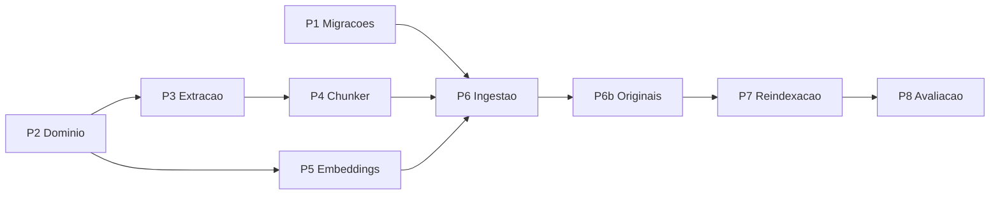

# Plano de Implementação — SPEC-002 Recuperação Semântica

**Spec**: [SPEC-20261007-002](SPEC-002-recuperacao-semantica.md) (Aprovada em 2026-10-07)
**Status do plano**: Em execução — P2 (parcial), P3 e P4 entregues em 2026-10-07
**Data**: 2026-10-07
**Elaborado com apoio de IA generativa, pendente de revisão do autor**

## 0. Andamento

| Pacote | Situação em 2026-10-07 |
|--------|------------------------|
| P1 Migrações | Não iniciado |
| P2 Domínio | Parcial: blocos, chunk, portas `DocumentChunker` e `TokenCounter`, nome de collection versionado. Faltam os campos novos de `Document` e `VectorChunk`, `embed_documents`/`embed_query` e as operações de alias, que entram com P1, P6 e P7 para não deixar contrato sem adaptador |
| P3 Extração | Entregue: `extract_supported_document` (Markdown, TXT, PDF, DOCX, DOC). A rota de upload ainda usa `extract_supported_text` |
| P4 Chunker | Entregue: `StructuralDocumentChunker`; CT-06 e CT-07 passam; CT-08 parcial |
| P5 Embeddings | Não iniciado |
| P6 Ingestão | Não iniciado |
| P6b Originais | Não iniciado |
| P7 Reindexação | Não iniciado |
| P8 Avaliação | Não iniciado |

O que foi entregue é aditivo: ingestão, chat e avaliação continuam no pipeline do MVP (hash e
corte de 700 caracteres). Isso é proposital — a linha de base da Fase 1 precisa ser gerada com
esse pipeline antes de P6 trocá-lo.

Verificação: 143 testes unitários passam (74 anteriores e 69 novos), executados fora do Docker,
em Python 3.13, com o LangGraph substituído por um dublê local. Nada foi executado no Docker.

## 1. Pré-requisitos (bloqueiam o aceite, não o início)

| # | Item | Situação | Por que importa |
|---|------|----------|-----------------|
| 1 | Linha de base oficial da Fase 1 | `backend/tests/evaluation/reports/` está vazio | CT-13 e RN-14 comparam com ela. Precisa ser gerada **com o embedding de hash**, antes de qualquer troca. |
| 2 | Testes de integração da Fase 1 no Docker | Não executados | A Fase 2 altera a subida da API (migrações); convém partir de um ambiente comprovado. |
| 3 | Aprovação da SPEC-002 e das ADRs 0006 e 0011 | Feita em 2026-10-07 | Regra do ciclo SDD. |
| 4 | Autorização de dependências novas | Feita em 2026-10-07 | `sentence-transformers`, PyTorch (CPU) e Alembic. |

## 2. Decisões

Registradas por Cleiton Medeiros em 2026-10-07 e incorporadas ao desenho da SPEC-002.

| # | Decisão | Escolha | Consequência |
|---|---------|---------|--------------|
| D1 | `CHUNK_MAX_TOKENS` e sobreposição | Limite do modelo carregado (128, a confirmar em P5), com 1 frase de sobreposição | O prefixo de seção e os tokens especiais contam no limite (L2). |
| D2 | Extração estruturada de PDF | Manter `pypdf` com heurísticas | Sem dependência nova; página vem do `pypdf`, seções por heurística. |
| D3 | Armazenamento dos originais | Antecipar uma versão mínima da Fase 5 | Novo pacote P6b; resolve L1; a Fase 3 não exigirá novo upload. Aumenta o escopo desta fase. |
| D4 | Execução da reindexação | Em segundo plano, no processo da API | `POST /reindex` responde 202; `index-status` informa o andamento; migra para o `worker` na Fase 5. |
| D6 | Dependências novas | Autorizadas | `sentence-transformers`, PyTorch (CPU) e Alembic. |
| D7 | Aprovação da SPEC-002 | Aprovada | Código liberado. |
| D8 | Limite de tamanho dos originais | 20 MB por arquivo | O upload passa a recusar arquivos maiores. |
| D9 | Andamento da reindexação | Tabela no PostgreSQL | Sobrevive ao reinício da API; impede duas reindexações simultâneas do mesmo assistente. |

Ainda em aberto:

| # | Decisão | Opções | Observação |
|---|---------|--------|------------|
| D5 | Conduta se o recall@5 ficar abaixo de 0,80 | Ajustar chunking; propor revisão da ADR 0004 | Só se decide diante do resultado de P8. |
| D10 | Orçamento de tokens do prefixo de seção | Valor fixo; fração do limite do chunk | O chunker recebe `max_prefix_tokens` e não tem valor padrão. Bloqueia P6. |

Limitações conhecidas do que foi entregue:

- **Títulos em PDF** só são reconhecidos quando numerados (`1 Introdução`, `2.1 Escopo`), em linha
  de até 12 palavras sem pontuação final. Um item de lista numerada sem ponto final pode ser
  tomado por título.
- **Frase maior que o limite** é cortada por palavras, fora de fronteira de frase.
- **Linha de tabela maior que o limite** é cortada e perde o cabeçalho.
- **Volume de vetores:** em seis documentos do piloto, medidos com um contador aproximado, o
  chunker gerou 116 chunks onde o corte de 700 caracteres gera cerca de 43.

## 3. Lacunas e conflitos encontrados

- **L1 — Reindexar sem originais.** A spec define que `ReindexAssistantUseCase` "reprocessa os
  documentos", mas também que os originais só são guardados na Fase 5. No código, o upload extrai
  o texto e descarta o arquivo; o PostgreSQL guarda apenas nome e hash. A rota
  `POST /assistants/{id}/reindex` não teria o que processar, exceto o texto dos chunks já gravados
  no Qdrant — que não serve para refazer o chunking estrutural. O piloto não sofre com isso,
  porque a avaliação semeia a base a partir de `docs/` (`--seed-dir`). **Resolvida por D3.**
- **L2 — Prefixo de seção e orçamento de tokens.** O chunker prefixa cada chunk com o caminho de
  títulos. Com limite de 128 tokens, um caminho longo pode consumir parcela relevante do chunk. A
  spec precisa dizer se o prefixo conta no limite (deve contar, senão é truncado) e o que fazer
  quando o caminho é longo demais.
- **L3 — Não há `worker`.** A spec cita os containers `backend` e `worker`; o segundo só nasce na
  Fase 5. Nesta fase a vetorização e a reindexação rodam no processo da API. **Resolvida por D4.**
- **L4 — Tokenizador fora do domínio.** O tamanho é medido com o tokenizador do modelo, mas o
  domínio não pode importar a biblioteca. É necessária uma porta de contagem de tokens, com dublê
  determinístico para os testes unitários.
- **L5 — Gateway de embedding criado por requisição.** `get_embedding_gateway` instancia o
  adaptador a cada chamada. Com modelo real, isso recarregaria o modelo; a spec exige carga única
  por processo.
- **L6 — Ingestão síncrona em CPU.** O upload continua síncrono até a Fase 5; documentos grandes
  vão demorar na requisição (R10). Fica registrado como limitação aceita desta fase.
- **L7 — Dependências sem versão fixa.** `qdrant-client` e `langgraph` não têm versão em
  `requirements.txt`; o adaptador já contorna diferenças de API (`search` x `query_points`). As
  operações de alias dependem da versão do cliente.
- **L8 — Conflito skill x código.** A skill cita `assistant_{assistant_id}`; o código usa
  `assistant-{id}`. Segue-se o código. A skill precisará refletir alias e versões ao fim da fase.
- **L9 — Conjunto de referência pequeno.** Com 27 itens (22 dentro do escopo), cada pergunta vale
  cerca de 4,5 pontos de recall. A ampliação para 50 a 100 itens continua pendente.

Referência: a simulação em memória da Fase 1 deu recall@5 de 0,59 com hash. A meta é 0,80.

## 4. Pacotes de trabalho

Cada pacote segue `TESTES → IMPLEMENTAÇÃO → VERIFICAÇÃO` e termina com a suíte unitária verde.

### P1 — Migrações versionadas (ADR 0011, RNF-31)

- Alembic configurado em `backend/`; migração inicial equivalente aos SQL `0001` a `0003` mais a
  coluna `assistants.initial_prompt`.
- Bancos existentes são marcados na versão inicial, sem recriar tabelas.
- Segunda migração: `documents.embedding_model`, `pipeline_version`, `chunk_count`.
- Subida do backend aplica as migrações antes do Uvicorn; saem `create_all` e
  `_ensure_incremental_columns` de `api/main.py`.
- Teste de integração: banco vazio e banco do MVP chegam ao mesmo esquema; reversão funciona.

### P2 — Contratos do domínio

- Documento extraído em blocos (tipo, texto, caminho de seção, página).
- Portas novas: `DocumentChunker` e contagem de tokens (L4).
- `EmbeddingGateway`: `embed_documents` e `embed_query`.
- `VectorChunk`: `section_path`, `page`, `embedding_model`, `pipeline_version`.
- `Document`: `embedding_model`, `pipeline_version`, `chunk_count`.
- `CollectionName`: nome versionado (`assistant-{id}-v{n}`) e nome do alias.
- `VectorStoreGateway`: `point_alias`, `resolve_alias` e contagem de pontos.
- Testes unitários de invariantes.

### P3 — Extração estruturada

- `text_extraction` passa a devolver blocos: Markdown (títulos, listas, tabelas), TXT
  (parágrafos), DOCX (estilos de título e tabelas), PDF (página; seções conforme D2), DOC (texto).
- Mantém validações e mensagens de erro atuais.
- Testes unitários por formato, com arquivos fictícios.

### P4 — Chunker estrutural (RF-29, RF-30)

- `StructuralDocumentChunker` na infraestrutura, com os cinco passos da spec.
- Testes: CT-06 (frases e tabelas), CT-07 (limite de tokens), CT-08 (metadados).

### P5 — Adaptador de embeddings (RF-28, RNF-26, RNF-32)

- `SentenceTransformerEmbeddingGateway`: lê `EMBEDDING_MODEL_NAME`, confere a dimensão com
  `EMBEDDING_VECTOR_SIZE`, expõe o limite de sequência e recusa `CHUNK_MAX_TOKENS` acima dele.
- Instância única por processo (L5).
- Docker: PyTorch em variante CPU, volume `backend_cache`, execução sem rede após o primeiro
  download.
- `LocalHashEmbeddingGateway` fica restrito aos testes.
- Testes de integração: CT-10 (384 dimensões sem rede) e CT-11 (paráfrase entre os cinco).
- Confirma o limite de 128 tokens do modelo (pendência da Fase 1).

### P6 — Ingestão, chat e avaliação

- `IngestDocumentUseCase` delega ao chunker, grava os metadados novos e registra modelo, versão e
  contagem no documento.
- Chat e avaliação passam a usar `embed_query`.
- O comando de avaliação usa o mesmo pipeline da ingestão.
- Ajuste dos testes unitários existentes.

### P6b — Armazenamento mínimo dos originais (D3, antecipa parte do RF-54)

- Porta de domínio para gravar e ler o arquivo original de um documento; adaptador em volume
  local do Compose.
- O upload grava o original antes de extrair o texto; `documents` registra a localização (entra
  na migração de P1).
- Fora do escopo: exclusão, substituição, deduplicação e reprocessamento individual (Fase 5).
- Testes unitários com dublê em memória; integração com o volume.

### P7 — Collections versionadas e reindexação (RF-31, RNF-18, RN-16)

- Qdrant: criação de versão, alias, troca atômica, remoção da versão anterior.
- Migração inicial das collections do MVP (indisponibilidade única, prevista na spec).
- `ReindexAssistantUseCase` lê os originais (P6b), roda em segundo plano na API e descarta a
  versão parcial em caso de falha. Documentos sem original são listados no `index-status`.
- Uma reindexação por assistente de cada vez.
- Rotas `POST /assistants/{id}/reindex` (202) e `GET /assistants/{id}/index-status`.
- Testes: CT-09 (falha mantém a vigente) e CT-12 (troca de alias sob consultas concorrentes).

### P8 — Avaliação, verificação e documentação

- CT-13: avaliação no piloto, comparada com a linha de base.
- Atualização de spec (`Implementada`), ADRs (`Aceita`), README, infraestrutura, estratégia de
  testes, riscos e skill do desenvolvedor.

## 5. Ordem

P1 e P5 são independentes do restante e podem começar primeiro. P5 é o pacote de maior incerteza
(tamanho da imagem, memória, funcionamento sem rede) e o que mais cedo confirma o limite do
modelo; convém antecipá-lo. O plano incremental estima 3 a 4 semanas para a fase; P6b não
estava nessa estimativa.

## 6. Critérios de conclusão

- CT-06 a CT-13 passam; a suíte anterior (74 testes) continua verde.
- Os seis cenários Gherkin da spec são demonstráveis no Docker.
- Relatório de avaliação registrado, com recall@5 ≥ 0,80 no piloto, ou decisão D5 registrada.
- Nenhum arquivo fora dos módulos listados é alterado.
