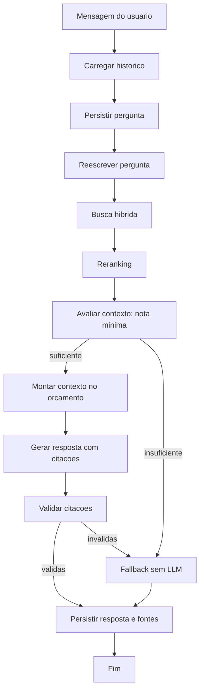

# Spec: Busca Híbrida, Reranking e Citações

**ID**: SPEC-20261007-003
**Status**: Rascunho
**Autor**: Cleiton Medeiros (elaborada com apoio de IA generativa, pendente de revisão)
**Data**: 2026-10-07
**Fase**: 3 de 6 — etapa 11 do [plano incremental](../../plano-incremental.md)
**Depende de**: SPEC-20261007-002

## Contexto e Problema

Mesmo com embeddings semânticos, a busca densa falha em siglas, códigos e nomes próprios, que
dependem de correspondência exata. A busca atual devolve sempre os quatro vizinhos mais próximos,
sem nota mínima: enquanto a collection tiver conteúdo, o fallback praticamente não dispara e o LLM
responde a partir de trechos irrelevantes.

A pergunta é enviada à busca como foi digitada, de modo que perguntas de continuação ("e para
estagiários?") perdem o assunto. O histórico inteiro é enviado ao LLM, sem limite. E as respostas
não indicam de onde vieram, o que impede o usuário de conferi-las.

## Requisitos Funcionais

- [ ] RF-33: busca híbrida densa e esparsa com fusão RRF.
- [ ] RF-34: reranking local dos candidatos.
- [ ] RF-35: nota mínima de relevância e fallback sem LLM.
- [ ] RF-36: reescrita da pergunta com o histórico.
- [ ] RF-37: citações devolvidas e persistidas com a mensagem.
- [ ] RF-38: fontes exibidas no chat.
- [ ] RF-39: orçamento de tokens para histórico e contexto.

## Requisitos Não Funcionais

- [ ] RNF-16: recuperação em até 3 segundos para 95% das perguntas, em CPU.
- [ ] RNF-20: fidelidade mínima de 0,90.
- [ ] RNF-21: fallback em pelo menos 90% das perguntas fora de escopo.
- [ ] RNF-26: vetores esparsos e reranking executados localmente.
- [ ] RNF-33: fontes acessíveis em um clique.

## Regras de Negócio

- RN-17: só trechos acima da nota mínima compõem o contexto; sem eles, fallback sem LLM.
- RN-18: resposta sem citação válida é substituída pelo fallback.
- RN-19: histórico limitado ao orçamento, preservando as mensagens recentes.

## Critérios de Aceite (Gherkin)

```gherkin
Funcionalidade: Respostas confiáveis e verificáveis

  Cenário: Recuperar termo exato
    Dado um documento indexado que menciona "NR-35" em um único trecho
    Quando o usuário pergunta "o que diz a NR-35?"
    Então o trecho que contém "NR-35" está entre os cinco primeiros após o reranking

  Cenário: Pergunta de continuação
    Dado que o usuário perguntou sobre a política de férias e recebeu resposta
    Quando o usuário pergunta "e para estagiários?"
    Então a consulta enviada à busca menciona férias e estagiários

  Cenário: Pergunta fora do escopo
    Dado que a base do assistente não trata do assunto perguntado
    Quando o usuário envia a pergunta
    Então nenhum candidato atinge a nota mínima
    E o sistema responde com o fallback
    E o LLM de geração não é chamado

  Cenário: Resposta com fontes
    Dado que a busca devolveu trechos acima da nota mínima
    Quando a resposta é gerada
    Então a resposta referencia ao menos um trecho recuperado
    E a API devolve as citações com documento, seção e página
    E as citações ficam gravadas junto da mensagem

  Cenário: Resposta sem citação válida
    Dado que o LLM devolveu um texto que não referencia nenhum trecho recuperado
    Quando o sistema valida a resposta
    Então a resposta é substituída pelo fallback

  Cenário: Conversa longa
    Dado uma conversa cujo histórico excede o orçamento de tokens
    Quando o usuário envia nova pergunta
    Então apenas as mensagens mais recentes que cabem no orçamento são enviadas ao LLM

  Cenário: Exibir fontes no chat
    Dado uma resposta com citações exibida no chat
    Quando o usuário clica em uma fonte
    Então o trecho citado é exibido com o nome do documento, a seção e a página
```

## Design da Solução

### Busca híbrida

- Cada collection passa a ter dois vetores nomeados: `dense` (384 dimensões, cosseno) e `sparse`
  (BM25, com modificador IDF calculado pelo Qdrant).
- Nova porta de domínio `SparseEmbeddingGateway`; implementação local `Bm25SparseEmbeddingGateway`.
- `VectorStoreGateway.search` é substituída por `hybrid_search`, que usa a Query API do Qdrant com
  duas pré-buscas (densa e esparsa) e fusão por Reciprocal Rank Fusion. A Query API está disponível
  na versão 1.11.3 já utilizada.
- A consulta aceita um filtro de payload opcional, já preparado para as restrições de acesso da
  SPEC-004.
- A inclusão do vetor esparso exige reindexação, feita com o `ReindexAssistantUseCase` da SPEC-002.

### Reranking

- Nova porta de domínio `RerankerGateway`: recebe a consulta e os candidatos e devolve os
  candidatos com nota de relevância.
- Implementação `CrossEncoderRerankerGateway`, executada localmente em CPU, com modelo definido
  por `RERANKER_MODEL_NAME` (sugestão inicial: um cross-encoder multilíngue leve, a confirmar na
  avaliação).
- Fluxo: recuperar `RETRIEVAL_CANDIDATES` candidatos, reordenar e manter os `RERANK_TOP_N`
  melhores acima de `RELEVANCE_MIN_SCORE`.

### Grafo conversacional



| Nó | Situação | Observação |
|----|----------|------------|
| Carregar histórico, persistir pergunta | Existente | Sem alteração |
| Reescrever pergunta | Novo | Usa o `LLMGateway`; é ignorado quando não há histórico |
| Busca híbrida | Alterado | Substitui a busca densa simples |
| Reranking | Novo | Usa o `RerankerGateway` |
| Avaliar contexto | Alterado | Passa a usar a nota mínima em vez de "lista vazia" |
| Montar contexto no orçamento | Novo | Aplica `CONTEXT_TOKEN_BUDGET` e `HISTORY_TOKEN_BUDGET` |
| Gerar resposta com citações | Alterado | Trechos numerados e delimitados no prompt |
| Validar citações | Novo | Confere se os marcadores apontam para trechos recuperados |
| Fallback, persistir | Existente | Persistência passa a incluir as fontes |

### Citações

- No prompt, cada trecho recebe um número e vem delimitado; o LLM é instruído a marcar as
  afirmações com `[n]`.
- `SearchResult` passa a carregar `source_name`, `section_path` e `page`.
- `LLMGateway.generate` passa a receber os trechos como objetos (texto e metadados), não mais como
  lista de strings.
- Nova entidade de domínio `Citation` (`document_id`, `source_name`, `section_path`, `page`,
  `chunk_id`, `score`, `excerpt`).
- Tabela `messages` recebe a coluna `citations` (JSON), por migração versionada.

### API

`POST /conversations/{id}/chat` passa a devolver, além da resposta:

| Campo | Descrição |
|-------|-----------|
| `citations` | Lista de fontes com documento, seção, página e trecho |
| `fallback_used` | Já existente |
| `rewritten_query` | Consulta efetivamente usada na busca, para diagnóstico |

`GET /conversations/{id}` devolve as citações de cada mensagem do assistente.

### Frontend

- `nexus.models.ts`: tipo `Citation` e campo `citations` na mensagem.
- Reducer e selectors: armazenar e expor as fontes por mensagem.
- Página de chat: lista de fontes sob cada resposta e painel com o trecho ao clicar.

### Novas variáveis

`RERANKER_MODEL_NAME`, `RETRIEVAL_CANDIDATES`, `RERANK_TOP_N`, `RELEVANCE_MIN_SCORE`,
`CONTEXT_TOKEN_BUDGET`, `HISTORY_TOKEN_BUDGET`.

## Impacto Arquitetural

- Domínio: portas `SparseEmbeddingGateway` e `RerankerGateway`; entidade `Citation`;
  `SearchResult`, `VectorStoreGateway` e `LLMGateway` alteradas.
- Aplicação: `ChatWithAssistantUseCase` com novos nós; DTOs com citações.
- Infraestrutura: adaptadores de BM25 e de reranking; Qdrant com vetores nomeados.
- API e frontend: contrato de chat ampliado.
- ADR: [0007 — Busca híbrida e reranking locais](../../arquitetura/adrs/0007-busca-hibrida-e-reranking.md).

## Estratégia de Testes

- Unitários: CT-14, CT-15, CT-16, CT-17, CT-21.
- Integração: CT-18, CT-19, CT-20.
- Avaliação: CT-22.

## Riscos e Dependências

- Latência do reranking em CPU (risco R10); mitigação: reduzir candidatos e medir cedo.
- A reescrita acrescenta uma chamada ao LLM por pergunta com histórico, aumentando custo e latência.
- Nota mínima mal calibrada gera fallback em excesso ou de menos (risco R2); calibrar com o
  conjunto de referência.
- Trechos recuperados são enviados ao provedor de LLM (risco R15).

## Decisões Pendentes

| Decisão | Opções | Impacto |
|---------|--------|---------|
| Valores de `RETRIEVAL_CANDIDATES`, `RERANK_TOP_N` e `RELEVANCE_MIN_SCORE` | Calibrar na avaliação; ponto de partida 30, 5 e nota a medir | Qualidade, latência e taxa de fallback |
| Modelo de reranking | Cross-encoder multilíngue leve; modelo maior e mais preciso | Latência em CPU e uso de memória |
| Formato da citação no texto | Marcadores `[n]`; resposta estruturada em JSON | Robustez da validação e compatibilidade entre provedores |
| Orçamentos de tokens | Valores fixos; proporção da janela do modelo | Custo por pergunta e continuidade da conversa |
