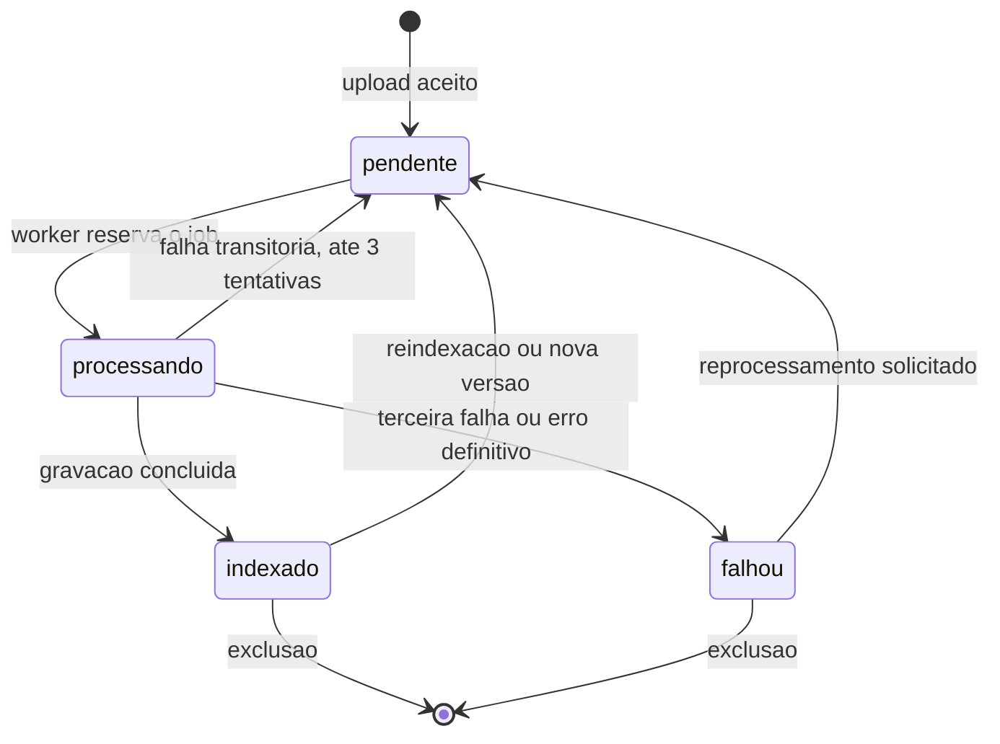

# Spec: Ingestão e Ciclo de Vida de Documentos

**ID**: SPEC-20261007-005
**Status**: Aprovada em 2026-10-08 por Cleiton Medeiros, com as decisões D1 a D10 do [plano](SPEC-005-plano-de-implementacao.md) — código entregue, aguardando validação no ambiente Docker
**Autor**: Cleiton Medeiros (elaborada com apoio de IA generativa, pendente de revisão)
**Data**: 2026-10-07
**Fase**: 5 de 6 — etapa 13 do [plano incremental](../../plano-incremental.md)
**Depende de**: SPEC-20261007-004

## Contexto e Problema

A ingestão acontece dentro da requisição HTTP de upload: extração, chunking, vetorização e
gravação no Qdrant são executados antes da resposta. Com embeddings reais, vetores esparsos e OCR,
esse tempo cresce e arquivos grandes passam a exceder o limite da requisição.

Não existe rota para excluir ou atualizar um documento: conteúdo desatualizado continua
respondendo até que o assistente inteiro seja removido. O mesmo arquivo pode ser enviado várias
vezes, duplicando trechos (RN-08). O arquivo original não é guardado, o que obriga novo upload a
cada reindexação. E PDFs digitalizados são rejeitados por não conterem texto.

## Requisitos Funcionais

- [ ] RF-48: ingestão assíncrona.
- [ ] RF-49: estado do documento exposto e exibido.
- [ ] RF-50: exclusão de documento.
- [ ] RF-51: substituição por nova versão.
- [ ] RF-52: detecção de arquivo idêntico.
- [ ] RF-53: OCR local e preservação de tabelas.
- [ ] RF-54: armazenamento do arquivo original e reprocessamento.
- [ ] RF-55: novas tentativas automáticas.

## Requisitos Não Funcionais

- [ ] RNF-02 (revisado): indexação de documento de até 10 MB concluída em até 60 segundos, em segundo plano.
- [ ] RNF-17: upload de até 25 MB responde em até 2 segundos.
- [ ] RNF-26: OCR executado localmente.
- [ ] RNF-27: processamento idempotente e retomável.
- [ ] RNF-33: estado atualizado na interface sem recarregar.

## Regras de Negócio

- RN-26: arquivo idêntico não gera novo documento (substitui a RN-08).
- RN-27: só documentos indexados participam das buscas.
- RN-28: versão anterior permanece ativa até a nova estar indexada.
- RN-29: exclusão remove vetores e arquivo; citações antigas ficam marcadas.
- RN-30: limite de 25 MB e de três tentativas.

## Critérios de Aceite (Gherkin)

```gherkin
Funcionalidade: Gestão de documentos da base de conhecimento

  Cenário: Upload em segundo plano
    Dado um curador com acesso ao assistente
    Quando ele envia um PDF de 20 MB
    Então a API responde em até 2 segundos
    E o documento aparece no estado "pendente"
    E depois passa a "processando" e a "indexado" sem recarregar a página

  Cenário: Arquivo duplicado
    Dado um arquivo já indexado no assistente
    Quando o curador envia o mesmo arquivo
    Então o sistema informa o documento existente
    E nenhum chunk novo é criado

  Cenário: Falha definitiva
    Dado um documento cujo processamento falha em três tentativas
    Quando a terceira tentativa termina
    Então o estado do documento é "falhou"
    E o motivo da falha é exibido ao curador

  Cenário: Worker reiniciado
    Dado um documento em processamento
    Quando o worker é encerrado e iniciado novamente
    Então o documento é processado até o estado "indexado"
    E a quantidade de chunks é a mesma de um processamento sem interrupção

  Cenário: Excluir documento
    Dado um documento indexado que é a única fonte sobre um assunto
    Quando o curador exclui o documento
    E um usuário pergunta sobre o assunto
    Então o sistema responde com o fallback
    E o arquivo original não existe mais no armazenamento

  Cenário: Substituir documento
    Dado um documento indexado em substituição por nova versão
    Quando a nova versão ainda está em processamento
    Então as respostas usam a versão anterior
    Quando a nova versão chega ao estado "indexado"
    Então apenas trechos da nova versão são recuperados

  Cenário: PDF digitalizado
    Dado um PDF que contém apenas imagens de páginas
    Quando o curador o envia
    Então o texto é extraído por OCR local
    E o documento chega ao estado "indexado"

  Cenário: Reprocessar sem novo upload
    Dado um documento no estado "falhou" com arquivo original armazenado
    Quando o curador solicita o reprocessamento
    Então o documento volta ao estado "pendente" e é processado novamente
```

## Design da Solução

### Fila e worker

- Nova porta de domínio `IngestionJobQueue` (enfileirar, reservar o próximo job, concluir, falhar).
- Implementação `PostgresIngestionJobQueue`, sobre a tabela `ingestion_jobs`, reservando jobs com
  `SELECT ... FOR UPDATE SKIP LOCKED`. Não é introduzido um broker de mensagens.
- Novo serviço `worker` no `compose.yaml`, com a **mesma imagem** do backend e outro comando de
  entrada. Continua sendo um monólito modular: não há microsserviço novo.
- O worker executa o `ProcessIngestionJobUseCase`, que reutiliza as mesmas portas da ingestão atual.
- Jobs reservados e não concluídos dentro de um tempo limite voltam à fila.

### Idempotência

- Identificadores de ponto no Qdrant já são determinísticos (`uuid5` de `document_id:chunk_index`),
  de modo que regravar um chunk não o duplica.
- Antes de gravar, o worker remove os pontos existentes do documento, garantindo que um
  reprocessamento com menos chunks não deixe resíduos.
- A mudança de estado e a conclusão do job ocorrem na mesma transação.

### Estados do documento



### Armazenamento dos originais

- Nova porta de domínio `DocumentFileStorage` (gravar, ler, excluir).
- Implementação `LocalVolumeDocumentFileStorage`, sobre o volume `documents_data`, montado em
  `backend` e `worker`.
- Caminho derivado do identificador do documento, nunca do nome informado pelo usuário.

### Extração

- A extração passa a devolver blocos estruturados (definidos na SPEC-002) e a reconhecer tabelas.
- Páginas de PDF sem camada de texto são encaminhadas ao OCR, executado localmente no worker.
- Idiomas do OCR configuráveis (`OCR_LANGUAGES`, padrão português e inglês).

### Exclusão e substituição

- `VectorStoreGateway` ganha `delete_by_document`, que remove pontos por filtro de `document_id`.
- `DocumentRepository` ganha `get_by_id`, `find_by_hash`, `update_status` e `delete`.
- Substituição: a nova versão é um novo registro ligado ao anterior (`replaces_document_id`); ao
  ser indexada, os pontos e o arquivo da versão anterior são removidos.
- Enquanto a nova versão é processada, seus pontos ficam com `active = false` no payload e são
  excluídos da busca por filtro; a ativação e a remoção da versão anterior ocorrem ao final (RN-28).

### Modelo de dados

| Tabela | Alteração |
|--------|-----------|
| `documents` | Novas colunas `status`, `failure_reason`, `attempts`, `storage_path`, `size_bytes`, `version`, `replaces_document_id`, `uploaded_by` |
| `ingestion_jobs` | Nova: `id`, `document_id`, `kind` (ingestão, reprocessamento, reindexação), `status`, `attempts`, `available_at`, `reserved_at`, `last_error` |

### API

| Rota | Papel | Descrição |
|------|-------|-----------|
| `POST /assistants/{id}/documents` | Curador, administrador | Passa a responder 202 com documento "pendente"; 409 em duplicidade |
| `GET /assistants/{id}/documents` | Com acesso ao assistente | Inclui estado, versão e motivo de falha |
| `GET /documents/{id}` | Com acesso ao assistente | Estado atual do documento |
| `DELETE /documents/{id}` | Curador, administrador | Exclui o documento |
| `PUT /documents/{id}/content` | Curador, administrador | Envia nova versão |
| `POST /documents/{id}/reprocess` | Curador, administrador | Reprocessa a partir do original |

### Frontend

- Lista de documentos com estado, versão e ações de excluir, substituir e reprocessar.
- Atualização do estado por consulta periódica enquanto houver documentos pendentes ou em processamento.
- Aviso de arquivo duplicado e confirmação de exclusão.

### Novas variáveis

`UPLOAD_MAX_BYTES`, `INGESTION_MAX_ATTEMPTS`, `INGESTION_JOB_TIMEOUT_SECONDS`,
`DOCUMENTS_STORAGE_PATH`, `OCR_LANGUAGES`.

## Impacto Arquitetural

- Domínio: portas `IngestionJobQueue` e `DocumentFileStorage`; `Document` com estado e versão.
- Aplicação: upload passa a enfileirar; novos casos de uso de processamento, exclusão,
  substituição e reprocessamento.
- Infraestrutura: fila em PostgreSQL, armazenamento em volume, OCR.
- Docker: novo serviço `worker` e volume `documents_data`; imagem com o mecanismo de OCR.
- A reindexação da SPEC-002 deixa de exigir novo upload.
- ADR: [0009 — Ingestão assíncrona com fila em PostgreSQL](../../arquitetura/adrs/0009-ingestao-assincrona.md).

## Estratégia de Testes

- Unitários: CT-33, CT-34, CT-35, CT-36.
- Integração: CT-37, CT-38, CT-39, CT-40.

## Riscos e Dependências

- Inconsistência entre PostgreSQL e Qdrant em falhas parciais (risco R18); mitigação: operações
  idempotentes e rotina de conferência de contagens.
- OCR é lento em CPU e de qualidade variável em digitalizações ruins.
- Documentos ingeridos antes desta fase não têm arquivo original e precisam de novo upload para
  reprocessamento (risco R9).

## Decisões

Tomadas em 2026-10-08; detalhes e efeito no código no [plano](SPEC-005-plano-de-implementacao.md).

| Decisão | Escolha |
|---------|---------|
| Mecanismo de OCR (D2) | Tesseract e Poppler como pacotes do sistema na imagem, chamados por processo |
| Limite de upload e variáveis (D3) | 25 MB; `UPLOAD_MAX_BYTES` e `DOCUMENTS_STORAGE_PATH`, aceitando os nomes antigos |
| Atualização do estado na interface (D4) | Consulta periódica a cada 3 s, só enquanto houver documento pendente ou processando |
| Histórico de versões (D5) | Só a versão vigente; a anterior fica registrada como `substituido`, sem trechos nem arquivo |
| Armazenamento dos originais em produção (D6) | Volume local; a porta permite trocar depois |
| Novas tentativas (D7) | 3 tentativas, esperas de 30 s e 120 s, job reservado por mais de 600 s volta à fila |
| Envio durante reindexação (D8) | Aceito; o job espera o fim da reindexação |
| Arquivo idêntico (D9) | Mesmo hash no mesmo assistente → 409 com o documento existente |
| Citação de documento excluído (D10) | Mantida na conversa e marcada como fonte removida |
