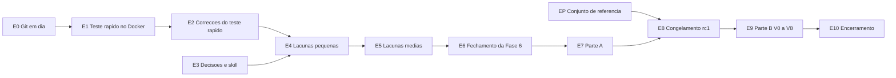

# Plano de Conclusão — Evolução RAG Enterprise

**Status**: Aprovado pelo autor em 2026-10-08, com as decisões PC-D1 a PC-D7 (seção 5); em execução (seção 8)
**Autor**: Cleiton Medeiros (elaborado com apoio de IA generativa, pendente de revisão)
**Data**: 2026-10-08
**Abrange**: tudo o que falta para encerrar as etapas 9 a 14 do [plano incremental](plano-incremental.md)
(SPEC-001 a SPEC-006, RF-24 a RF-63, RNF-01 a RNF-33)
**Meta de conclusão**: 2026-11-19, com contingência até 2026-11-27 (seção 7)

## 1. Objetivo

Levar o Nexus de "código das seis fases entregue" a "evolução RAG Enterprise concluída", com
evidência registrada e documentação coerente com o código. Este plano organiza, em etapas pequenas
e verificáveis, o trabalho que já está descrito em outros documentos:

- as lacunas de código registradas nos planos das SPEC-004, 005 e 006;
- a Parte A (preparação) e a Parte B (campanha V0 a V8) do
  [plano de validação final](qa/plano-de-validacao-final.md);
- a atualização da documentação ao longo do caminho e no encerramento.

Ele não substitui esses documentos: aponta para eles e define a ordem, os responsáveis, os
critérios de saída e as decisões que ainda faltam.

## 2. Definição de concluído

A evolução está 100% concluída quando todos os itens abaixo estiverem marcados:

- [ ] Campanha V0 a V8 aprovada sobre um commit etiquetado `validacao-final-rcN`, com push feito.
- [ ] `docs/qa/relatorios/<data>/RESUMO.md` liga cada requisito (RF-24 a RF-63, RNF-01 a RNF-33)
      a um caso de teste, uma evidência e um resultado.
- [ ] As sete metas do [escopo](negocio/escopo-rag-enterprise.md) comprovadas: recall@5 ≥ 0,80,
      fidelidade ≥ 0,90, fallback fora do escopo ≥ 90%, 100% das respostas geradas com fonte,
      zero vazamento, upload ≤ 2 s e 100% de respostas rastreáveis.
- [ ] Os seis critérios de aceite da evolução ligados a uma evidência.
- [ ] SPEC-001 a SPEC-006 com status `Implementada`.
- [ ] Linha de base oficial registrada em `backend/tests/evaluation/reports/`.
- [ ] Documentação atualizada conforme a seção 6, inclusive a skill `desenvolvedor-nexus`.
- [ ] Limitações aceitas (seção 5, PC-D7) registradas como tal, cada uma com a justificativa.

## 3. Situação de partida (2026-10-08)

| Fase | Código | Testes unitários | Docker | Pendências próprias |
|------|--------|------------------|--------|---------------------|
| 1 — Avaliação | Entregue | Executados | Nunca executada no ambiente completo | CT-04; linha de base oficial; conjunto de 27 → 80 itens |
| 2 — Recuperação semântica | Entregue (P1–P7) | Executados | Nunca | P8 (avaliação do piloto) |
| 3 — Híbrida, reranking, citações | Entregue (P1–P8) | Executados | Nunca | P9 (CT-22, calibração) |
| 4 — Autenticação e acesso | Entregue (P1–P8) | Executados | Nunca | Tela de conversas arquivadas; seleção de grupos; origens do realm |
| 5 — Ingestão e ciclo de vida | Entregue (P1–P8) | Executados | Nunca | Reindexação no worker; R18; revisar C9–C16 |
| 6 — Operação e governança | Entregue (P1–P8), sem push | Executados (497 no total) | Nunca | CT-46 a CT-48; revisar C1–C11; push |

Lacunas transversais: detecção de mudança em `BM25_*`; compatibilidade do `qdrant-client` 1.19.1
com o servidor Qdrant 1.11.3. As versões de `qdrant-client` e `langgraph` já estão fixadas no
`requirements.txt`.

O maior risco é que, desde a Fase 2, nenhum código rodou com PostgreSQL, Qdrant, Keycloak, modelos
reais ou o build do Angular. Por isso o plano começa pelo teste rápido no Docker.

## 4. Etapas

Responsáveis: **Autor** (Cleiton) e **Claude** (desenvolvimento assistido pela skill
`desenvolvedor-nexus`). Só o computador do autor alcança o Docker, e só a nuvem alcança o GitHub;
tudo que roda no Docker é executado pelo autor, com comandos e roteiros preparados por Claude.

### E0 — Git em dia

| | |
|-|-|
| Responsável | Claude (push pelo fluxo de bundle); Autor (apagar a branch antiga) |
| Tarefas | Push dos commits `f614544`..`feb0ae0` e do commit de documentação deste plano; apagar `feat/rag-enterprise-fase-1` no GitHub; `git fetch --prune` |
| Saída | `feat/rag-enterprise` igual no computador e no GitHub; workflow `ci.yml` executado pela primeira vez (resultado registrado, mesmo que falhe) |
| Esforço | 0,5 dia |

### E1 — Teste rápido no Docker

Exceção já aprovada à regra de validar só no final. Sem medições formais.

| | |
|-|-|
| Responsável | Autor (execução); Claude (roteiro e análise dos logs) |
| Roteiro | `docker compose up -d --build` → conferir `alembic current` na revisão mais nova (`head`) → login com `admin.nexus` → criar assistente e vincular grupo → enviar um PDF até `indexado` → pergunta com citação, em streaming → "não útil" com comentário → `docker compose logs backend worker keycloak qdrant > e1-logs.txt` |
| Também conferir | Aviso de compatibilidade do `qdrant-client` no log; tempo da primeira subida; `npm run build` do frontend dentro da imagem |
| Saída | Lista de defeitos, cada um com etapa, log e prioridade (bloqueante ou não) |
| Esforço | 0,5 dia |

### E2 — Correções do teste rápido

| | |
|-|-|
| Responsável | Claude (correção e testes); Autor (nova execução de E1) |
| Regra | Um commit por defeito ou por grupo de defeitos relacionados, com teste que o reproduz quando possível |
| Saída | Roteiro de E1 inteiro sem erro; defeitos registrados no plano da SPEC afetada |
| Esforço | 1 a 3 dias (incerto: depende de E1) |

### E3 — Decisões e skill em dia

Pode correr em paralelo a E1 e E2.

| | |
|-|-|
| Responsável | Autor (decidir PC-D1 a PC-D7; revisar C1–C11 da Fase 6 e C9–C16 da Fase 5); Claude (atualizar a skill) |
| Tarefas | Registrar as decisões da seção 5 neste plano; atualizar `.claude/skills/desenvolvedor-nexus/SKILL.md` e a cópia em `.cursor/skills/` para o estado atual (Keycloak, worker, BM25, reranker, citações, streaming, observabilidade, migrações Alembic, rotas e telas novas, ADRs 0006 a 0011) |
| Saída | Seção 5 preenchida; skill sem referências ao MVP (`LocalHashEmbeddingGateway`, rotas antigas) |
| Esforço | 0,5 dia do autor; 0,5 dia de Claude |

### E4 — Lacunas pequenas

| Lacuna | Entrega | Testes |
|--------|---------|--------|
| Origens do realm (PC-D1) | URL do frontend configurável no realm de desenvolvimento, sem editar o JSON à mão | Unitário do que for código; conferido no Docker em E9 |
| Detecção de `BM25_*` (PC-D2) | Parâmetros gravados com o índice; divergência detectada e sinalizada | Unitários |
| Compatibilidade do Qdrant | Se E1 mostrar aviso, alinhar a versão do servidor ou do cliente (decisão registrada) | Integração em E9 |

Esforço: 1,5 dia.

### E5 — Lacunas médias

| Lacuna | Entrega | Testes |
|--------|---------|--------|
| Reindexação no worker (PC-D4) | A API só enfileira; o worker processa; reinício do worker não perde nem duplica a reindexação | Unitários com a fila em memória; CT-53 cobre o reinício em E9 |
| Conferência PostgreSQL × Qdrant, R18 (PC-D3) | Comando que compara contagens por documento e aponta divergências, com código de saída ≠ 0 | Unitários; CT-57 |
| Conversas arquivadas (PC-D5) | Conforme a decisão | Unitários, reducer e E2E (E6 do plano de validação) |
| Seleção de grupos (PC-D6) | Lista de grupos na tela de assistentes e documentos, no lugar do texto livre | Unitários e E2E |

Cada lacuna segue o ciclo SDD do projeto: a mudança de comportamento entra primeiro na SPEC da fase
(seção "Decisões" ou "Comportamentos"), depois testes e código. Se alguma exigir migração, ela será
a `0007`. Esforço: 4 a 5 dias.

### E6 — Fechamento da Fase 6

| | |
|-|-|
| Tarefas | Escrever CT-46 (logs e spans sem token, chave ou texto integral de documento), CT-47 (roteiro automatizado de backup → ambiente limpo → restauração → contagens e uma busca) e CT-48 (regressão simulada faz o `quality-gate.sh` falhar); aplicar o que a revisão de C1–C11 pedir |
| Saída | Critério de entrada "CT-41 a CT-48 escritos" atendido |
| Esforço | 1 a 1,5 dia |

### E7 — Parte A do plano de validação

Exatamente o que está na seção 4 do [plano de validação final](qa/plano-de-validacao-final.md):

| Bloco | Itens | Esforço |
|-------|-------|---------|
| Integração do backend | CT-04, CT-39, CT-40, CT-49 a CT-57; auditoria dos repositórios PostgreSQL; cliente `nexus-tests` no realm de desenvolvimento (V-D2) | 3 a 4 dias |
| Frontend | FE-01 (`vitest.config.ts`) a FE-07 (Playwright, V-D4); componentes cobertos pelo E2E (V-D3) | 3 a 4 dias |
| Medição e orquestração | `scripts/perf/*`, `scripts/validation/run-all.ps1`/`.sh`, `env_snapshot.sh`; métrica "cobertura de citações" no comando de avaliação, se ainda não existir | 2 dias |

Os testes que não dependem do Docker são executados localmente; os demais só em E9.

### EP — Conjunto de referência (em paralelo, a partir de já)

| | |
|-|-|
| Responsável | Autor e curador (validação); Claude (rascunho das perguntas) |
| Tarefas | `nexus-docs.jsonl` de 27 para cerca de 80 itens (60 dentro e 20 fora do escopo), com pelo menos 8 de termo exato, 8 de continuação e 8 sobre tabelas de DOCX; criar `nexus-acesso` com documentos fictícios restritos por grupo (CT-56); corpus público de 100.000 chunks versionado por hash (V-D9) |
| Saída | Todos os itens com `validated_by`; hash do conjunto registrado |
| Esforço | 1 a 2 dias, distribuídos até E8 |

### E8 — Congelamento

| | |
|-|-|
| Tarefas | Conferir o critério de entrada (seção 2 do plano de validação); árvore limpa; etiqueta `validacao-final-rc1`; push; aprovar o custo estimado de LLM (600 a 900 chamadas) |
| Saída | Commit candidato etiquetado no GitHub |
| Esforço | 0,5 dia |

### E9 — Parte B (campanha V0 a V8)

Conforme as seções 5 a 9 do [plano de validação final](qa/plano-de-validacao-final.md), executada
pelo autor com o orquestrador `run-all`. Cada falha segue a seção 9 daquele plano (novo commit,
`rc2`, reexecução). Se o recall@5 ficar abaixo de 0,80 depois da calibração, a campanha é suspensa
até a decisão D5 da SPEC-002.

Esforço: 2 a 3 dias sem defeitos; até 3 candidatos (`rc3`).

### E10 — Encerramento

Atualização final da documentação (seção 6.2) e do estado no projeto. Esforço: 1 dia.

## 5. Decisões pendentes

A regra da skill `desenvolvedor-nexus` exige decisão do autor antes de implementar escolhas de
formato, limite ou comportamento. Em 2026-10-08 o autor aceitou todas as sugestões (coluna
"Sugestão") e aprovou como estão os comportamentos C1–C11 da SPEC-006 e C9–C16 da SPEC-005.

| ID | Decisão | Opções | Sugestão (decidida) |
|----|---------|--------|---------------------|
| PC-D1 | Origens do realm | (a) Placeholders de variável de ambiente no `nexus-realm.json` (o Keycloak substitui `${VAR}` na importação), com `NEXUS_FRONTEND_URL` no `.env`; (b) script que gera o JSON a partir de um modelo | (a): sem script novo, e o padrão continua `http://localhost:4200` |
| PC-D2 | Mudança em `BM25_*` sem reindexar | (a) Gravar `k1`, `b` e comprimento médio no estado do índice; divergência gera aviso no log, métrica e marca "reindexação necessária" na tela, sem bloquear; (b) recusar buscas até reindexar | (a): bloquear a busca derruba o assistente por um ajuste de parâmetro |
| PC-D3 | Conferência PostgreSQL × Qdrant (R18) | (a) Comando `python -m src.cli.check_consistency` sob demanda; (b) (a) + execução diária pelo worker com métrica; (c) rota de administrador | (a) agora; (b) fica registrada como evolução |
| PC-D4 | Reindexação no worker | (a) Worker passa a reservar também os jobs de `reindex_jobs` (`FOR UPDATE SKIP LOCKED`, como a fila de ingestão), com limite de tempo e retomada; (b) unificar numa só fila com tipo de job | (a): reaproveita a tabela de andamento atual e evita migrar a fila de ingestão |
| PC-D5 | Conversas arquivadas | A SPEC-004 (D3) diz "não exibidas a ninguém", mas o plano de validação (cenário E6) diz "visíveis ao dono", e elas não têm dono. (a) Tela do administrador para listar, ler e excluir (eram públicas no MVP); (b) tela do administrador só com metadados e exclusão; (c) manter D3 e retirar a lacuna, com um comando para exportar ou apagar | (a), corrigindo o cenário E6 do plano de validação e registrando a mudança na SPEC-004 |
| PC-D6 | Seleção de grupos | (a) Backend lista os grupos pela API de administração do Keycloak, com um cliente de serviço `nexus-backend` só de leitura (um segredo novo); (b) lista configurável `ACCESS_GROUPS` no `.env`; (c) campo livre com sugestões dos grupos já usados | (a): o Keycloak é a fonte da verdade (ADR 0008); o segredo segue o padrão das variáveis de ambiente |
| PC-D7 | Limitações aceitas na conclusão | Confirmar que não bloqueiam os 100%: tabelas em PDF como texto corrido (D11); limite de uso não atômico (C2); `/metrics` na porta 8000 local (C9); backup só local (D5); sem tela de versões substituídas (D5 da SPEC-005) | Aceitar todas e listá-las no `RESUMO.md` e na seção "Limitações" do README |

## 6. Atualização da documentação

### 6.1 Regra contínua

Ao fim de cada etapa:

1. Atualizar a tabela de andamento deste plano (seção 8).
2. Atualizar o plano de implementação da SPEC afetada (andamento, decisões, comportamentos).
3. Atualizar a situação dos casos em [`estrategia-de-testes.md`](especificacao/estrategia-de-testes.md).
4. Novas variáveis em [`variaveis-ambiente.md`](infraestrutura/variaveis-ambiente.md) e no
   `.env.example`; novos serviços ou comandos em [`servicos.md`](infraestrutura/servicos.md) e
   [`docker-local.md`](infraestrutura/docker-local.md); problemas encontrados em
   [`troubleshooting.md`](infraestrutura/troubleshooting.md).
5. Decisão de arquitetura nova → ADR (por exemplo, se PC-D6 trouxer o cliente de serviço do Keycloak, ajustar a ADR 0008).
6. Commit de documentação separado do código, como no restante do projeto.

### 6.2 Mapa de atualizações por etapa

| Documento | O que muda | Quando |
|-----------|------------|--------|
| `plano-incremental.md`, `escopo-rag-enterprise.md`, `specs/README.md`, `README.md`, `estrategia-de-testes.md`, `plano-de-validacao-final.md` | Situação real das fases e link para este plano | Feito em 2026-10-08, junto com este plano |
| Skill `desenvolvedor-nexus` (`.claude` e `.cursor`) | Estado atual da arquitetura | E3 |
| SPEC-004 e plano | PC-D1, PC-D5, PC-D6; fim da lista de lacunas | E4 e E5 |
| SPEC-005 e plano | PC-D3, PC-D4; R18 resolvido | E5 |
| SPEC-002/003 e planos | PC-D2; compatibilidade do Qdrant | E4 |
| SPEC-006 e plano | CT-46 a CT-48; C1–C11 revisados | E6 |
| `infra/keycloak/README.md` | Variável do frontend; cliente `nexus-tests`; cliente de serviço, se houver | E4, E5, E7 |
| `docs/arquitetura/c4-*.md`, `visao-geral.md`, `frontend-angular-ngrx.md` | Worker com reindexação, comando de consistência, telas novas | E5 (feito em 2026-10-08) |
| `docs/gestao-riscos/` (ciclo 2) | Situação de R9 a R20 depois da campanha (R17, R18 em especial) | E10 |
| SPEC-001 a 006 e `specs/README.md` | Status `Implementada` | E10 |
| `plano-incremental.md`, `escopo-rag-enterprise.md`, `README.md` | Fases concluídas; metas com os valores medidos; seção "Limitações" | E10 |
| `backend/tests/evaluation/reports/` | Linha de base oficial | E10 |
| `docs/qa/relatorios/<data>/` | Evidências da campanha | E9 |
| Estado no projeto Nexus (claude.ai) | Resumo do andamento | Ao fim de cada etapa |

## 7. Cronograma

Para uma pessoa dedicada, considerando os feriados de 12/10, 02/11 e 20/11.

| Semana | Datas | Etapas |
|--------|-------|--------|
| 0 | 08–09/10 | E0; E1 |
| 1 | 13–16/10 | E2; E3; início de E4; EP começa |
| 2 | 19–23/10 | Fim de E4; E5 |
| 3 | 26–30/10 | Fim de E5; E6; E7 (integração do backend) |
| 4 | 03–06/11 | E7 (frontend, medição); EP concluída |
| 5 | 09–13/11 | Fim de E7; E8 (rc1 em 11/11); início de E9 |
| 6 | 16–19/11 | E9 (com `rc2`, se houver defeito); E10 |
| Contingência | 23–27/11 | `rc3` e correções |

O ponto de maior incerteza é E2: se o teste rápido revelar defeitos estruturais, o cronograma é
refeito ao fim da semana 1.

## 8. Andamento

| Etapa | Situação | Data | Observação |
|-------|----------|------|------------|
| E0 | Concluída, exceto apagar branches | 2026-10-08 | Push até `8518f7b`. O primeiro CI no GitHub passou no backend e na infraestrutura e falhou no frontend: faltava `@tailwindcss/typography` no `package-lock.json` (corrigido em `ea66f5d`, lock gerado pelo npm no GitHub Actions). Falta o autor apagar `feat/rag-enterprise-fase-1` e `chore/sync-lock` no GitHub (o proxy da sessão não permite) |
| E1 | Roteiro pronto | 2026-10-08 | `scripts/validation/quick-check.ps1` grava as evidências em `docs/qa/relatorios/<data>-e1/`; falta o autor executar |
| E2 | Pendente | — | — |
| E3 | Concluída | 2026-10-08 | PC-D1 a PC-D7 decididas; C1–C11 (SPEC-006) e C9–C16 (SPEC-005) aprovados; skill `desenvolvedor-nexus` atualizada nas duas cópias |
| E4 | Em andamento | 2026-10-08 | PC-D1 (`NEXUS_FRONTEND_URL` no realm, checagem no CI) e PC-D2 (parâmetros do BM25 registrados por collection; aviso no painel novo "Índice de busca" da tela de assistentes, que também permite reindexar, no log e na métrica; 12 testes unitários do backend e specs do frontend) entregues. Falta a compatibilidade do Qdrant, que depende de E1 |
| E5 | Concluída | 2026-10-08 | PC-D4 entregue: a API só registra o pedido; o worker reserva `reindex_jobs` com `SKIP LOCKED` e prazo renovado por documento (migração `0007`), retoma do zero após interrupção e falha depois de `INGESTION_MAX_ATTEMPTS`; 7 testes unitários e 3 de integração (PostgreSQL). PC-D3 entregue: `python -m src.cli.check_consistency` (só lê; códigos de saída 0, 1 e 2; 10 testes unitários em `test_index_consistency.py`). PC-D5 entregue: tela "Conversas arquivadas" do administrador (`/admin/archived`; listar, ler e excluir, com auditoria; SPEC-004 D3 ajustada; 6 testes unitários e specs do frontend). PC-D6 entregue: `GET /groups` lê os grupos pelo cliente de serviço `nexus-backend` (só `query-groups`; 503 sem ele) e a tela de assistentes usa um seletor que volta ao texto livre sem a lista; 7 testes unitários e specs do frontend |
| E6 | Pendente | — | CT-41 a CT-45 escritos |
| E7 | Pendente | — | — |
| EP | Pendente | — | 27 itens validados |
| E8 | Pendente | — | — |
| E9 | Pendente | — | — |
| E10 | Pendente | — | — |

## 9. Riscos do plano

| Risco | Efeito | Resposta |
|-------|--------|----------|
| Muitos defeitos no primeiro contato com o Docker | E2 se estende e empurra tudo | Priorizar o que bloqueia o roteiro de E1; refazer o cronograma ao fim da semana 1 |
| Recall@5 abaixo de 0,80 depois da calibração | Campanha suspensa (D5 da SPEC-002) | Antecipar uma avaliação informal do piloto logo depois de E2, ainda sem valor oficial |
| Curador indisponível | EP atrasa e bloqueia E8 | Começar EP agora; Claude prepara os rascunhos |
| Indexar 100.000 chunks em CPU demora demais | V7 se estende | Indexar o corpus antes da campanha, numa máquina livre; registrar o tempo |
| Custo e variação do LLM | Avaliação instável | 3 execuções (V-D5) e custo aprovado em E8 |
| Desenvolvimento com um único executor do Docker | Gargalo no autor | Agrupar as execuções no Docker em sessões curtas, com roteiro e comandos prontos |
