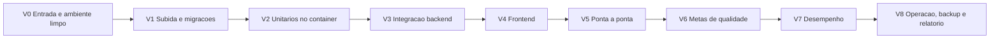

# Plano de Validação Final — Evolução RAG Enterprise

**Status**: Rascunho; decisões V-D1 a V-D9 tomadas em 2026-10-08 (sugestões da seção 10 aceitas)
**Autor**: Cleiton Medeiros (elaborado com apoio de IA generativa, pendente de revisão)
**Data**: 2026-10-08
**Abrange**: SPEC-001 a SPEC-006 (RF-24 a RF-63, RNF-01 a RNF-33)
**Quando executar**: somente depois que **toda** a implementação estiver concluída (Fase 6 e
lacunas das Fases 1 a 5). Ver a seção 2.

**Ordem e prazos**: ver o [plano de conclusão](../plano-de-conclusao.md), etapas E7 a E9.

## 1. Objetivo

Provar, com evidência registrada e repetível, que o Nexus entrega 100% do previsto na evolução RAG
Enterprise. O plano cobre quatro frentes:

1. **Testes de integração do backend**: executar os que existem e escrever os que faltam.
2. **Frontend**: testes unitários com o Vitest real, build de produção e testes de ponta a ponta.
3. **Metas de qualidade e segurança** do [escopo da evolução](../negocio/escopo-rag-enterprise.md).
4. **Requisitos de desempenho**: RNF-01, 02, 03, 16, 17 e 18, além de RNF-09/32 e RNF-28.

### Duas partes, dois momentos

| Parte | O que é | Quando acontece |
|-------|---------|-----------------|
| **A — Preparação** | Escrever os testes que faltam, os scripts de medição, o orquestrador e ampliar o conjunto de referência | Durante a implementação, junto com a Fase 6 e as lacunas. Nada é executado contra o ambiente Docker |
| **B — Execução** | Rodar tudo, na ordem das etapas V0 a V8, e registrar as evidências | Uma única campanha, ao final, sobre um commit congelado |

Seguindo o SDD, os testes da Parte A podem rodar localmente quando não dependem do Docker (por
exemplo, a sintaxe e os dublês). A validação que conta é a da Parte B.

## 2. Critério de entrada da Parte B

A campanha só começa quando todos os itens abaixo estiverem marcados:

- [ ] SPEC-006 aprovada e implementada, com CT-41 a CT-48 escritos. Aprovada e com código entregue
      em 2026-10-08; CT-41 a CT-45 escritos, CT-46 a CT-48 pendentes.
- [x] D11 decidida (tabelas em PDF), e implementada se a opção for (a). Decidida em 2026-10-08: (b) adiar.
- [ ] Lacunas de código fechadas:
  - [x] blocos `#region agent log` removidos (2026-10-08);
  - [x] `MarkdownPipe` sem HTML não sanitizado (2026-10-08);
  - [x] conferência das contagens PostgreSQL × Qdrant (R18; PC-D3, `src.cli.check_consistency`, 2026-10-08);
  - [x] reindexação no worker (PC-D4, migração `0007`, 2026-10-08);
  - [x] tela de conversas arquivadas (PC-D5, `/admin/archived`, 2026-10-08);
  - seleção de grupos;
  - [x] versões de `qdrant-client` e `langgraph` fixadas (2026-10-08, pelo `pip freeze` da imagem;
    falta conferir a compatibilidade do cliente 1.19.1 com o servidor Qdrant 1.11.3);
  - [x] detecção de mudança em `BM25_*` (PC-D2, 2026-10-08);
  - [x] origens do realm configuráveis (PC-D1, `NEXUS_FRONTEND_URL`, 2026-10-08).
- [ ] Parte A concluída (seção 4), com todos os testes novos revisados.
- [ ] Conjunto de referência ampliado e **validado pelo curador** (seção 6.1).
- [x] Decisões V-D1 a V-D9 tomadas (seção 10): sugestões aceitas em 2026-10-08.
- [ ] Árvore de trabalho limpa, commit congelado e etiquetado (`validacao-final-rc1`), com push feito.

Qualquer correção feita durante a campanha gera um novo commit, um novo rótulo (`rc2`…) e a
reexecução definida na seção 9.

## 3. Princípios

- **Mesmo commit para tudo.** Cada relatório registra o commit, a data, os modelos e os parâmetros.
- **Falha bloqueia.** Uma etapa reprovada interrompe a campanha até a correção (seção 9).
- **Nenhum teste ignorado** sem justificativa escrita. Os `skip` atuais (3, por modelo ausente)
  precisam passar ou ter a causa registrada.
- **Evidência em arquivo**, nunca só em tela: logs, relatórios JSON/Markdown e CSVs de desempenho
  vão para `docs/qa/relatorios/<data>/`.
- **Dados fictícios ou públicos**, conforme as premissas do escopo.
- **Sem dependência nova** sem decisão registrada (regra da skill `desenvolvedor-nexus`). Por isso
  os scripts de medição usam só a biblioteca padrão do Python.
- **Execução pelo autor.** O computador de desenvolvimento é o único que alcança o Docker. Por isso
  tudo é disparado por um orquestrador único (`scripts/validation/run-all.ps1` e `.sh`) que grava
  as evidências.

## 4. Parte A — Preparação (escrita, sem execução)

### 4.1 Inventário atual

| Casos | Existe? | Onde |
|-------|---------|------|
| CT-05, CT-07, CT-10, CT-11, CT-12, CT-18, CT-19, CT-20 | Sim, nunca executados no Docker | `backend/tests/integration/` |
| CT-26 a CT-31 | Sim, nunca executados | `test_access_control_api.py`, `test_access_control_storage.py` |
| CT-37, CT-38 | Sim, só no nível de repositório | `test_document_lifecycle_storage.py` |
| Rotas da Fase 5 (202, 409, excluir, substituir, reprocessar) | Sim, com repositórios em memória | `test_api_routes.py` |
| CT-04 | **Não**: só existe a execução manual de `eval.sh` | — |
| CT-39 | **Parcial**: o teste unitário usa Tesseract `eng`; não há teste no container com `por` | — |
| CT-40 | **Não** | — |
| CT-41 a CT-43 | Sim, executados como testes unitários | `test_operations.py`, `test_feedback.py` |
| CT-44, CT-45 | Sim, nunca executados | `test_operations_api.py`, `test_chat_citations.py` |
| CT-46 a CT-48 | **Não** | — |
| Migrações (RNF-31) | **Não** | — |
| Keycloak real (RNF-22) | **Não**: os testes assinam tokens com uma chave local | — |
| Fluxo completo na pilha real | **Não**: as rotas usam repositórios em memória | — |
| Frontend: 7 specs (reducers, PKCE, OIDC, acesso, ciclo de vida) | Sim, rodados só com substitutos | `frontend/src/**/*.spec.ts` |
| Frontend: effects, interceptor, guard, pipe, componentes, E2E | **Não** | — |

Os testes de integração não estão na imagem (`backend.Dockerfile` copia só `src`). Por isso serão
montados como volume, como já faz `scripts/eval.sh`.

### 4.2 Testes de integração do backend a escrever

A numeração continua a da [estratégia de testes](../especificacao/estrategia-de-testes.md).

| ID | Arquivo | O que verifica | Requisitos |
|----|---------|----------------|------------|
| CT-04 | `test_evaluation_command.py` | `python -m src.cli.evaluate --no-generation` sobre um conjunto mínimo gera relatório JSON e MD com commit, modelos e parâmetros; uma regressão simulada termina com código de saída ≠ 0 | RF-25, RF-26, RN-14 |
| CT-39 | `test_ocr_container.py` | PDF digitalizado em português (gerado no teste) chega a `indexado`, e um trecho é recuperado por termo com acento | RF-53 |
| CT-40 | `test_upload_latency.py` | Upload de 25 MB responde 202 em até 2 s, com o tempo medido no cliente (complementa a seção 7) | RNF-17 |
| CT-49 | `test_migrations.py` | Banco vazio → `upgrade head` → `downgrade base` → `upgrade head` sem erro; banco no esquema 0001 com dados → `upgrade head` preserva assistentes, conversas e documentos | RNF-31 |
| CT-50 | `test_full_stack_flow.py` | Na pilha real (API, PostgreSQL, Qdrant, worker e modelos locais), com LLM simulado por um servidor HTTP compatível com OpenAI criado no próprio teste (`http.server`): criar assistente → enviar → `indexado` → perguntar → resposta com citação → excluir documento → citação "fonte removida" | RF-37, RF-48 a RF-50, D10 |
| CT-51 | `test_assistant_isolation.py` | Dois assistentes com documentos distintos não se misturam; excluir o assistente remove a collection e os aliases | RNF-07, RNF-08 |
| CT-52 | `test_keycloak_real.py` | Token emitido pelo Keycloak do Compose é aceito (JWKS, `iss`, `aud`, `exp` reais); token adulterado, de outro realm ou expirado responde 401; papéis e grupos do token chegam à política | RNF-22, RF-40, RF-41 (depende de V-D2) |
| CT-53 | `scripts/validation/worker_resilience.sh` | `docker kill` no worker durante um job → o job volta à fila após o limite e termina sem chunks duplicados; `docker stop` (SIGTERM) conclui o job em andamento | RNF-27, C9 |
| CT-54 | `scripts/validation/offline_check.sh` | Com a rede externa bloqueada (rede `internal` no Compose) e `HF_HUB_OFFLINE=1`, a ingestão, a busca, o reranking e o OCR funcionam | RNF-26 |
| CT-55 | `test_nginx_proxy.py` | Corpo acima de 26 MB → 413 no Nginx; `/docs` e `/openapi.json` ausentes pelo proxy; rota de streaming sem buffer (`X-Accel-Buffering`) | RF-59, C15, RF-58 |
| CT-56 | `scripts/validation/leakage_scan.py` | Varredura de vazamento: para cada usuário do realm, perguntas dirigidas a documentos restritos de outros grupos; nenhuma citação nem trecho pode vir de documento não autorizado | RNF-23, meta "zero vazamento" |
| CT-57 | `test_consistency_check.py` | A conferência PostgreSQL × Qdrant aponta divergência quando um ponto é apagado manualmente | R18 |

Também é preciso auditar `test_access_control_storage.py` e `test_document_lifecycle_storage.py`,
para confirmar que cada repositório PostgreSQL (assistentes, conversas, mensagens, citações,
documentos, jobs, auditoria, permissões) tem pelo menos um teste real de gravação e leitura. O
que faltar entra em `test_postgres_repositories.py`.

### 4.3 Frontend a preparar

| ID | Item | Detalhe |
|----|------|---------|
| FE-01 | Configuração do Vitest | `vitest.config.ts` e o arquivo de setup que os specs exigirem (por exemplo `@angular/compiler`), validados com os 7 specs atuais |
| FE-02 | Effects | Envio de vários arquivos com `mergeMap` (C16); consulta a cada 3 s que para ao sair da tela (D4); tratamento de 409 por duplicidade; streaming, feedback e 429 (Fase 6). Com timers simulados do Vitest |
| FE-03 | Interceptor e guard | Bearer apenas para a API; 401 leva ao login; `roleGuard` por papel (completa o CT-32) |
| FE-04 | `MarkdownPipe` | `<script>`, `onerror=` e `javascript:` não chegam ao DOM (depois da correção) |
| FE-05 | Selectors | Citações por mensagem, documentos por estado e menu por papel |
| FE-06 | Componentes | Depende de V-D3: com TestBed no Vitest ou cobertos só pelo E2E |
| FE-07 | Ponta a ponta | Depende de V-D4. Roteiro da seção 5.4, automatizado (Playwright) ou manual, com captura de tela |

### 4.4 Ferramentas de medição e orquestração

Todas em Python, só com a biblioteca padrão, executadas dentro do container `backend`:

| Arquivo | Função |
|---------|--------|
| `scripts/perf/corpus.py` | Gera um corpus sintético determinístico (semente fixa) até 100.000 chunks, além de arquivos de 10 MB e 25 MB em PDF com texto, DOCX e PDF digitalizado. Arquivos diferentes entre si, para não cair na duplicidade por hash (D9) |
| `scripts/perf/upload_latency.py` | RNF-17 |
| `scripts/perf/indexing_time.py` | RNF-02: do 202 até `indexado`, consultando `GET /documents/{id}` |
| `scripts/perf/retrieval_latency.py` | RNF-03 (busca densa direta no adaptador) e RNF-16 (busca híbrida e reranking pelo caso de uso, com o tempo da etapa lido do span ou do log `duration_ms`) |
| `scripts/perf/ttft.py` | RNF-01: tempo até o primeiro evento de texto do SSE |
| `scripts/perf/reindex_under_load.py` | RNF-18: carga do RNF-16 durante a reindexação |
| `scripts/perf/report.py` | Consolida os CSVs em p50, p95, p99, máximo e taxa de erro |
| `scripts/validation/run-all.ps1` e `.sh` | Executa V0 a V8 na ordem, para na primeira falha bloqueante e grava em `docs/qa/relatorios/<data>/` |
| `scripts/validation/env_snapshot.sh` | Registra CPU, RAM, recursos do Docker/WSL2, versões das imagens, modelos e commit |

## 5. Parte B — Execução



A ordem vai do mais barato e determinístico ao mais caro (LLM e carga). Não vale medir desempenho
de um sistema que ainda falha em teste funcional.

### V0 — Entrada e ambiente limpo

1. Conferir o critério de entrada (seção 2) e o rótulo do commit.
2. Rodar `env_snapshot.sh`.
3. `docker compose down -v` e remover as imagens do projeto, para partir do zero (o cache de
   modelos é baixado uma única vez e depois preservado, conforme RNF-32).
4. Varreduras estáticas, que precisam voltar vazias:
   - `#region agent log` e `127.0.0.1:7657`;
   - `bypassSecurityTrustHtml` sem sanitização;
   - segredos no repositório (`.env` fora do Git).

**Saída**: `00-ambiente.md`.

### V1 — Subida e migrações (RNF-09, RNF-32, RNF-31)

1. Medir o tempo de `docker compose up -d --build` até todos os healthchecks ficarem saudáveis
   (backend, worker, frontend, PostgreSQL, Keycloak, Qdrant).
2. `alembic upgrade head` limpo; conferir `alembic current` = `0007_reindex_in_worker (head)` (ou a revisão mais nova).
3. Login manual em `http://localhost:4200` com `admin.nexus`.
4. Reiniciar o ambiente e confirmar que o histórico é retomado (critério do MVP).

**Aprovação**: um único comando sobe tudo, sem erro nos logs de inicialização.

### V2 — Testes unitários no container

```bash
docker compose run --rm --no-deps -v ./backend/tests:/app/tests backend \
  python -m unittest discover -s tests/unit -v
```

Usa o LangGraph real, não o dublê. Inclui CT-41 a CT-43 da Fase 6. Também mede a cobertura de
`domain` e `application` (RNF-30, mínimo de 80%), conforme V-D1.

**Aprovação**: 100% dos testes passando e cobertura de pelo menos 80%.

### V3 — Integração do backend

```bash
docker compose run --rm -v ./backend/tests:/app/tests backend \
  python -m unittest discover -s tests/integration -v
```

Seguido dos scripts CT-53, CT-54 e CT-56 e da integração da Fase 6 (CT-44 a CT-47).

Ordem interna:

1. Migrações (CT-49).
2. Repositórios e Qdrant (CT-12, CT-28, CT-31, CT-37, CT-38, CT-57).
3. Modelos (CT-07, CT-10, CT-11, CT-18, CT-19, CT-39).
4. API (CT-05, CT-20, CT-26 a CT-30, CT-40, CT-55).
5. Keycloak real (CT-52).
6. Fluxo completo (CT-50, CT-51).
7. Resiliência e rede (CT-53, CT-54).
8. Segurança (CT-46, CT-56).
9. Fase 6 (CT-44, CT-45, CT-47).

**Aprovação**: todos passam. Os testes de segurança recorrentes (CT-23, CT-26 a CT-29, CT-46,
CT-56) não admitem exceção.

### V4 — Frontend

```bash
cd frontend
npm ci
npm test
npm run build -- --configuration production
```

Inclui FE-01 a FE-06 e o CT-21 e o CT-32 com o Vitest real. Também roda `npm audit --omit=dev`,
apenas para registro: vulnerabilidade alta ou crítica precisa de uma decisão registrada.

**Aprovação**: testes passando, build sem erro e orçamentos do `angular.json` respeitados.

### V5 — Ponta a ponta (FE-07)

Executado pela interface, com os usuários do realm. Inclui os roteiros já existentes em
[`validacao-manual-rag-enterprise.md`](validacao-manual-rag-enterprise.md) (Fases 1 a 6) e em
[`validacao-manual-admin-chat-ingestao.md`](validacao-manual-admin-chat-ingestao.md), mais:

| # | Cenário | Requisitos |
|---|---------|------------|
| E1 | Login de cada papel; menu e rotas conforme o papel; logout | RF-46, CT-32 |
| E2 | Curadora envia 3 arquivos de uma vez; os estados mudam sem recarregar | C16, RNF-33 |
| E3 | Duplicidade avisada; substituir; reprocessar um documento com falha | RF-51, RF-52, RF-54 |
| E4 | Resposta com fontes; trecho aberto em um clique; excluir o documento → "fonte removida" | RF-38, RNF-33, D10 |
| E5 | `usuario.financeiro` não vê o assistente de RH (403) nem trechos restritos | RF-42, RF-43 |
| E6 | Auditoria lista as ações; conversas arquivadas conforme a decisão PC-D5 do [plano de conclusão](../plano-de-conclusao.md) | RF-45, Fase 4 |
| E7 | Streaming progressivo; avaliação "não útil" com comentário; limite atingido com mensagem e horário | RF-58, RF-59, RF-61 |
| E8 | Tela de consumo do administrador | RF-57 |
| E9 | LLM fora do ar (URL inválida) → erro compreensível | RNF-14 |
| E10 | Indicador de carregamento acima de 500 ms; layout a 360 px de largura | RNF-13, RNF-15 |
| E11 | Documento com instrução maliciosa não altera o comportamento, e a tentativa é registrada | RF-60 |

**Aprovação**: todos os cenários passam, com captura de tela de cada um.

### V6 — Comprovação das metas

Ver a seção 6.

### V7 — Desempenho

Ver a seção 7.

### V8 — Operação, backup e encerramento

1. `scripts/backup.sh` → ambiente limpo → `scripts/restore.sh` → conferência de contagens e uma
   busca (CT-47). Registrar a duração e o tamanho do backup.
2. Confirmar o agendamento diário do backup, conforme a decisão de frequência e destino da SPEC-006 (RNF-28: RPO ≤ 24 h).
3. CT-48: rodar o pipeline de integração contínua com uma regressão simulada e verificar que ele
   falha. Depois, rodar sem a regressão e verificar que passa.
4. Coletar `docker stats` das etapas V6 e V7, com e sem o perfil `observability` (R17).
5. Gerar o relatório final (seção 8) e atualizar a documentação.

## 6. Comprovação das metas

### 6.1 Conjunto de referência (preparado na Parte A)

- Ampliar `nexus-docs.jsonl` de 27 para cerca de 80 itens (V-D7):
  - pelo menos 60 dentro do escopo;
  - pelo menos 20 fora do escopo. Com só 5, a meta de 90% exige 5 de 5 e não tem significado
    estatístico.
- Incluir pelo menos 8 perguntas de termo exato (como "NR-35"), 8 de continuação (reescrita com
  histórico) e 8 sobre tabelas (DOCX; D11 = b, tabelas de PDF adiadas).
- Criar o conjunto `nexus-acesso`, com documentos fictícios restritos por grupo, para o CT-56.
- **Validação pelo curador**: cada item com `validated_by` preenchido. O conjunto é congelado com
  um hash registrado no relatório.

### 6.2 Protocolo

- Mesmo commit, mesmo `LLM_MODEL` (juiz igual, como na SPEC-001), mesmos parâmetros do reranker.
- **3 execuções completas** de `scripts/eval.sh nexus-docs` (V-D5), para medir a variação do LLM.
- Linha de base comparativa: executar também o commit `9dcf007` com o mesmo conjunto, para mostrar
  o ganho da evolução. Essa execução é informativa e não reprova a campanha.
- **Calibração (CT-22)**: se uma meta falhar só por parâmetro, varrer no máximo:
  - candidatos {20, 30, 50};
  - top-k {3, 5, 8};
  - nota mínima {0,3; 0,4; 0,5; 0,6}.

  A mudança de parâmetro vira commit novo e repete V2, V3 e V6 (seção 9).
- Se o recall@5 continuar abaixo de 0,80 depois da calibração, aplica-se a decisão D5 da SPEC-002
  (ajustar o chunking ou propor revisão da ADR 0004). A campanha fica suspensa até a decisão.

### 6.3 Metas e critérios

| Meta | Indicador | Critério de aprovação | Fonte |
|------|-----------|-----------------------|-------|
| Encontrar a informação certa | Recall@5 | ≥ 0,80 em cada uma das 3 execuções (RNF-19, CT-13) | Relatório da avaliação |
| Ordenação | MRR | Registrado, sem meta; não pode regredir acima de 0,02 da execução anterior (RN-14) | Relatório da avaliação |
| Respostas fiéis | Fidelidade | ≥ 0,90 na média, e nenhuma execução abaixo de 0,88 (RNF-20, CT-22) | Relatório da avaliação |
| Não inventar | Fallback em perguntas fora do escopo | ≥ 90% (RNF-21, CT-22), sem chamada ao LLM | Relatório da avaliação e logs |
| Resposta verificável | Respostas geradas com ≥ 1 fonte | 100% (RF-37). Se o relatório ainda não calcular, incluir a métrica "cobertura de citações" no comando de avaliação na Parte A | Relatório da avaliação |
| Conhecimento protegido | Trechos restritos recuperados por não autorizados | Zero (CT-28, CT-56) | V3 |
| Curadoria sem espera | Resposta do upload | ≤ 2 s (RNF-17, CT-40) | V7 |
| Operação previsível | Respostas rastreáveis | 100% de uma amostra de 50 perguntas: cada `request_id` tem um span por nó do grafo e a chamada ao LLM (RNF-29, CT-44) | V7 e coletor |
| Sem regressão | Avaliação na integração contínua | Regressão simulada bloqueia (CT-48) | V8 |
| Critérios de aceite da evolução | Os 6 itens do escopo | Cada um ligado a uma evidência no relatório | Relatório final |

**Custo estimado de LLM** (para aprovar antes): cerca de 80 itens × 3 execuções × 2 chamadas
(resposta e juiz), mais a calibração, o TTFT (100) e o E2E. Algo entre 600 e 900 chamadas.

## 7. Medição de desempenho

### 7.1 Condições

- Hardware de referência registrado (V-D8); Docker com CPU e RAM fixas. Sem GPU (os RNF falam em
  CPU).
- Aquecimento: 10 requisições descartadas antes de cada medição, para carregar os modelos.
- Uma medição por vez, sem outra carga na máquina; o perfil `observability` desligado, exceto na
  medição do RNF-29.
- Corpus de 100.000 chunks gerado por `corpus.py` num assistente dedicado (V-D9), indexado antes
  de V7.3. O tempo dessa indexação também é registrado.

### 7.2 Cenários

| Req. | Cenário | Amostras | Métrica | Critério |
|------|---------|----------|---------|----------|
| RNF-17 / CT-40 | Upload de 25 MB (PDF e DOCX distintos), cliente dentro da rede do Compose e também pelo Nginx | 30 | Tempo até o 202 | **Todas** ≤ 2 s; p50 e p95 registrados |
| RNF-02 | Documento de 10 MB: PDF com texto, DOCX e PDF digitalizado (OCR), um por vez, com a fila vazia | 10 por tipo | Do 202 até `indexado` | ≤ 60 s para PDF com texto e DOCX. Para OCR o resultado é registrado e, se exceder, vira decisão documentada (a spec não distingue OCR) |
| RNF-02 (fila) | 20 documentos de 1 MB enviados de uma vez | 1 rodada | Vazão e tempo total | Informativo; nenhum documento duplicado ou perdido (RNF-27) |
| RNF-03 | Busca densa top-k sobre 100.000 vetores | 200 consultas | Latência | < 2 s em todas |
| RNF-16 | Busca híbrida + RRF + reranking de 30 candidatos, 100.000 chunks, CPU | 200 perguntas | Latência da etapa de recuperação | p95 ≤ 3 s, com 1 e com 5 usuários simultâneos (o RNF fala em 95%; com 5 simultâneos é informativo) |
| RNF-18 | Mesma carga do RNF-16 durante a reindexação do assistente de 100.000 chunks | Durante toda a reindexação | Erros e p95 | Zero erros; p95 dentro da tolerância de V-D6 em relação ao RNF-16 |
| RNF-01 | Pergunta com contexto pela rota de streaming, LLM externo real | 100 (5 simultâneos) | Tempo até o primeiro token | p95 ≤ 30 s |
| RNF-29 | 50 perguntas com o perfil `observability` | 50 | Rastreamentos completos | 100% |
| RNF-09 / RNF-32 | Subida do zero com cache de modelos | 1 | Tempo até tudo saudável | Um comando; tempo registrado |
| RNF-28 | Backup diário + restauração | 1 | Duração do backup e da restauração; RPO | RPO ≤ 24 h comprovado pelo agendamento e pelo CT-47 |

### 7.3 Saídas

Cada cenário gera um CSV com uma linha por amostra (início, fim, duração, status, `request_id`).
`report.py` consolida p50, p95, p99, máximo, taxa de erro e o veredito em `07-desempenho.md`,
junto com o snapshot do ambiente.

## 8. Relatório final e atualização da documentação

`docs/qa/relatorios/<data>/` contém:

- `00-ambiente.md`
- `01-subida.md`
- `02-unitarios.log`
- `03-integracao.log`
- `04-frontend.log`
- `05-e2e.md` (com as capturas de tela)
- `06-metas.md` (com os relatórios da avaliação)
- `07-desempenho.md` (com os CSVs)
- `08-operacao.md`
- `RESUMO.md`: matriz requisito → caso → evidência → resultado, cobrindo RF-24 a RF-63 e RNF-01 a
  RNF-33

Com a campanha aprovada:

- SPEC-001 a SPEC-006 → `Implementada`.
- Atualizar a situação dos casos em `estrategia-de-testes.md`.
- Atualizar `plano-incremental.md` e o andamento em `escopo-rag-enterprise.md`.
- Registrar a linha de base oficial em `backend/tests/evaluation/reports/`.
- Atualizar a skill `desenvolvedor-nexus` para o estado final.

## 9. Tratamento de falhas

| Situação | Conduta |
|----------|---------|
| Teste funcional falha (V1 a V5) | Registrar o defeito (ID, etapa, evidência); corrigir em commit novo; repetir **V2 e V3 completos** e a etapa onde falhou |
| Meta de qualidade falha (V6) | Calibração da seção 6.2; o parâmetro novo exige repetir V2, V3 e V6 |
| Desempenho falha (V7) | Investigar com os spans; se a correção mexer em código de recuperação, repetir V3, V6 e V7 |
| Teste instável | Executar 3 vezes. Se oscilar, é defeito do teste ou do sistema e não pode ser ignorado |
| Limite de rodadas | Depois de 3 candidatos (`rc3`) sem aprovação, parar e revisar o escopo com o autor |

Os defeitos ficam listados em `RESUMO.md`, com a correção e o commit.

## 10. Decisões (tomadas em 2026-10-08: coluna Sugestão aceita)

| ID | Decisão | Opções | Sugestão |
|----|---------|--------|----------|
| V-D1 | Medir a cobertura (RNF-30) | (a) `coverage` só na execução de teste (`pip install` no container, sem alterar `requirements.txt`); (b) não medir | (a): é a única forma de comprovar o RNF-30 |
| V-D2 | Token real do Keycloak no CT-52 | (a) cliente `nexus-tests` com *direct access grants* apenas no realm de desenvolvimento; (b) automatizar o login PKCE pelo navegador | (a): o realm de produção não teria esse cliente |
| V-D3 | Testes de componentes Angular | (a) plugin Angular para o Vitest (dependência nova); (b) cobrir componentes só pelo E2E | (b), se V-D4 for automatizado |
| V-D4 | Ponta a ponta | (a) Playwright no frontend (dependência nova de desenvolvimento; o Chromium já existe no ambiente); (b) roteiro manual com capturas de tela | (a): o E2E vira repetível na integração contínua |
| V-D5 | Repetições e critério da avaliação | 1 execução; 3 execuções com o critério da seção 6.3 | 3 execuções |
| V-D6 | Tolerância de degradação na reindexação (RNF-18) | p95 até +20%; até +50%; apenas zero erros | +20% e zero erros |
| V-D7 | Tamanho do conjunto | 50; 80; 100 itens | 80 (60 dentro e 20 fora do escopo) |
| V-D8 | Hardware de referência | Máquina do autor; outra | Máquina do autor, com recursos do Docker fixos e registrados |
| V-D9 | Texto do corpus de 100.000 chunks | Sintético por modelo de frases; textos de domínio público em português | Domínio público, versionado por hash, sem entrar no Git |

## 11. Estimativa

| Parte | Esforço |
|-------|---------|
| A — testes de integração (CT-04, 39, 40, 49 a 57) | 3 a 4 dias |
| A — frontend (FE-01 a FE-07) | 2 a 3 dias (+1 se Playwright) |
| A — scripts de medição e orquestrador | 2 dias |
| A — ampliação do conjunto (redação + validação do curador) | 1 a 2 dias |
| B — campanha sem defeitos | 2 a 3 dias, a maior parte em indexação de 100.000 chunks e avaliação |
| B — correções e rodadas | Imprevisível; o limite é o da seção 9 |
